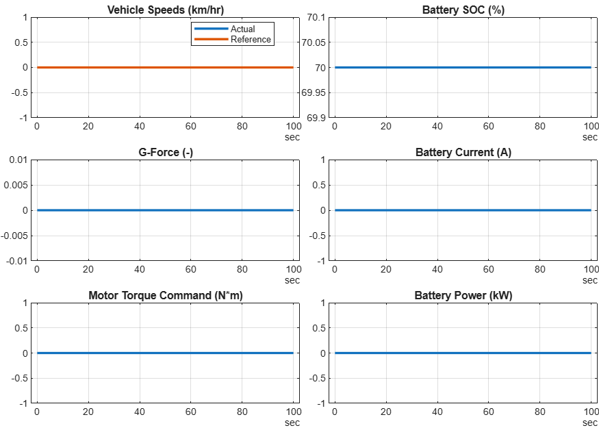

# <span style="color:rgb(213,80,0)">BEV System Model \- Simulation Case</span>

Using constant inputs, make sure the model loads and simulation runs.

```matlab
model_name = "BEV_system_model";
load_system(model_name)


BEV_setup_Basic
```

```matlabTextOutput
Use Basic models for all components.
Loading in base workspace: Vehicle1D_Basic_params
Loading in base workspace: BatteryHV_Basic_params
Loading in base workspace: MotorDriveUnit_Basic_params
Loading in base workspace: Reducer_Basic_params
Loading in base workspace: BEVController_Basic_params
```

```matlab


sim_in = Simulink.SimulationInput(model_name);


sim_in = setBlockParameter(sim_in, ...
  model_name + "/Controller and Environment/Vehicle speed reference", ...
  ReferencedSubsystem = "VehSpdRef_Constant_refsub");


sim_in = setModelParameter(sim_in, StopTime = "100");


applyToModel(sim_in)


sim_out = sim(sim_in);


sim_data = extractTimetable(sim_out.logsout);


fig = BEV_plotResults(TimedData = sim_data, PlotTemperature = false);
```

<center></center>

*Copyright 2023\-2026 The MathWorks, Inc.*