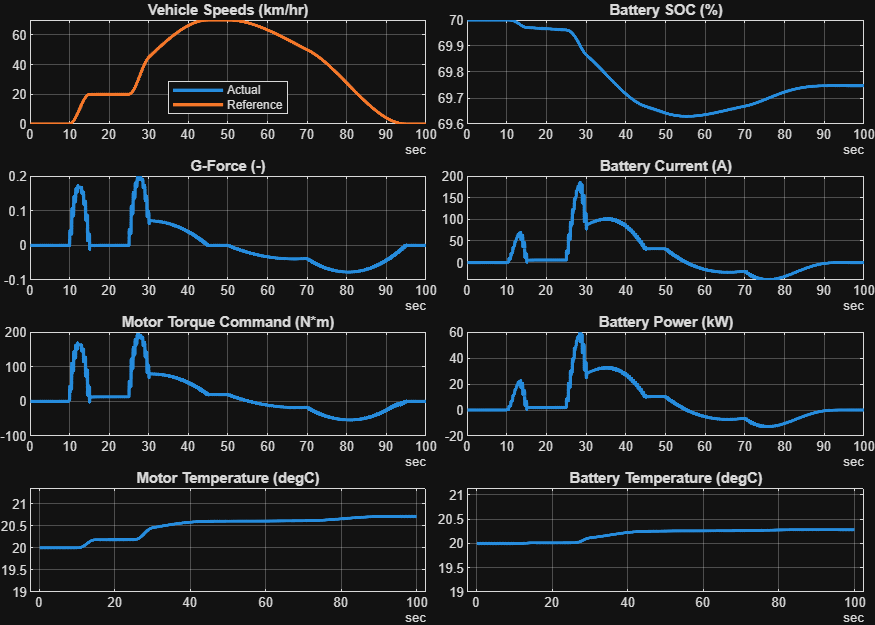

# <span style="color:rgb(213,80,0)">BEV System Model \- Simulation Case</span>
```matlab
modelName = "BEV_system_model";
load_system(modelName)
BEV_setThermal
```

```matlabTextOutput
Use Thermal models if available.
Loading in base workspace: Vehicle1D_Basic_params
Loading in base workspace: BatteryHV_SystemThermal_params
Loading in base workspace: MotorDriveUnit_BasicThermal_params
Loading in base workspace: Reducer_Basic_params
Loading in base workspace: BEVController_Basic_params
```

```matlab
VehSpdRef_setSimCase_SimpleDrivePattern( ...
  ModelName = modelName, ...
  TargetSubsystemPath = "/Controller & Environment/Vehicle speed reference")
```

```matlabTextOutput
Setting up simulation...
Simulation case: Simple drive pattern
Setting simulation stop time to 100 sec.
Selecting simulation case 1.
```

```matlab
simOut = sim(modelName);
simData = extractTimetable(simOut.logsout);
fig = BEV_ResultsCompactPlot(SimData = simData);
```

<center></center>


*Copyright 2023\-2025 The MathWorks, Inc.*

