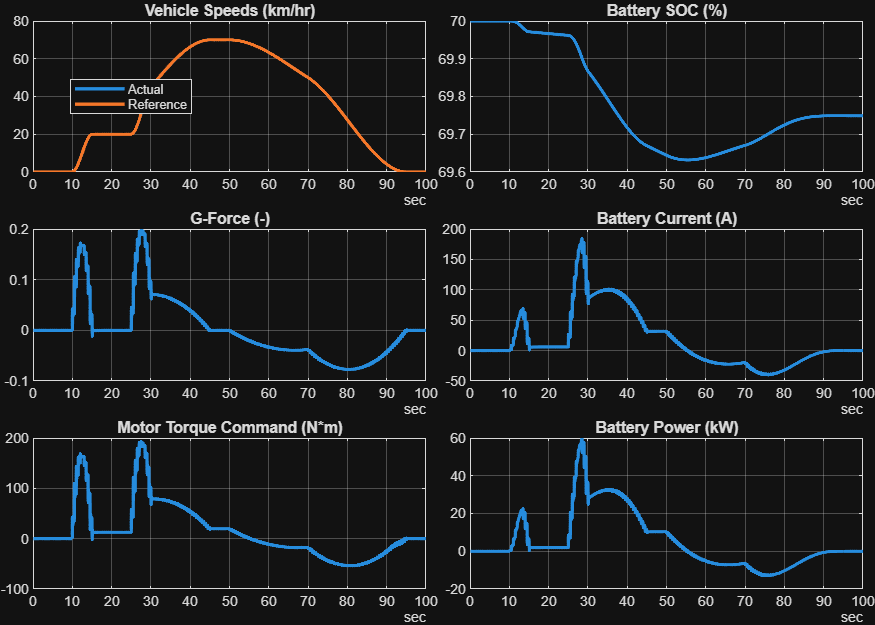

<a id="T_0F8BC05C"></a>

# <span style="color:rgb(213,80,0)">Battery Electric Vehicle (BEV) System Level Model</span>
<!-- Begin Toc -->

## Table of Contents
&emsp;[Introduction](#H_A0C28D4F)
 
&emsp;[Run Simulation](#H_EC484CEF)
 
&emsp;[Save Result](#H_EF7BCF44)
 
&emsp;[Analyse Result](#H_81E3C32A)
 
<!-- End Toc -->
<a id="H_A0C28D4F"></a>

# Introduction

This is a simple, fast running BEV model which can estimate the electrical efficiency of the vehicle. It is also suitable for further customizations for more focused analysis of individual components at vehicle system level.


To open the model, navigate Toolstrip > Project Shortcut tab, and click the "**BEV model**" button.


This script shows an example workflow to programmatically open model, run simulation, collect simulation data, visualize result, save data to text\-format file, read saved data file, and analyze. Feel free to modify this script (probably saving as another file first) and experiment to get new results.


You can find more scripts demonstrating other simulation cases in the BEV > Model\-\* > SimulationCases folders.

<a id="H_EC484CEF"></a>

# Run Simulation

This section sets up the model and runs simulation. To run this script at once, navigate Toolstrip > Live Editor tab, and click the Run button. You can also run this section only by clicking the Run Section button.

```matlab
modelName = "BEV_system_model";

% Load the model file.
load_system(modelName)

% Set referenced subsystems and load parameters.
BEV_setBasic
```

```matlabTextOutput
Use Basic models for all components.
Loading in base workspace: Vehicle1D_Basic_params
Loading in base workspace: BatteryHV_Basic_params
Loading in base workspace: MotorDriveUnit_Basic_params
Loading in base workspace: Reducer_Basic_params
Loading in base workspace: BEVController_Basic_params
```

```matlab
% Load drive cycle.
VehSpdRef_setSimCase_SimpleDrivePattern( ...
  ModelName = modelName, ...
  TargetSubsystemPath = "/Controller & Environment/Vehicle speed reference" )
```

```matlabTextOutput
Setting up simulation...
Simulation case: Simple drive pattern
Setting simulation stop time to 100 sec.
Selecting simulation case 1.
```


If you want to change some parameter values, do it here:

```matlab
% Your code goes here.
```

Run simulation, collect logged data, and visualize the result.

```matlab
simOut = sim(modelName);
simData = extractTimetable(simOut.logsout);
fig = BEV_ResultsCompactPlot( SimData=simData, PlotTemperature=false );
% Save the plot to a PNG file.
imgFilename = "BEV_SimulationResultPlot.png";
exportgraphics(fig, fullfile(currentProject().RootFolder, "BEV", "simulation-results", imgFilename))
```

<center></center>

<a id="H_EF7BCF44"></a>

# Save Result

Save logged signals to a CSV file for later analysis. CSV text format is used rather than binary format for saving the data. Text format works better when the data size is small and the file is version\-managed with a source control tool such as git.

```matlab
% Extract logged signals at once with extractTimetable.
simData = extractTimetable(simOut.logsout);

% Adjust time format so as not to lose the subsecond information.
simData.Time.Format = "hh:mm:ss.SSSS";

% Signal names to save in file.
% These must be specified in the model as signal logging names.
% For example, in the BEV system model, see the Measurement subsystem.
dataColumns = [ ...
  "HV Battery SOC", "HV Battery Power", "HV Battery Current", ...
  "G-Force", "Vehicle Speed kph" ];

% Select the logged signals to save.
simData = simData(:, dataColumns);

% Add unit information to signal names.
varNames = string(simData.Properties.VariableNames');
varUnits = string(simData.Properties.VariableUnits');
varNames2 = varNames + " (" + varUnits + ")";
disp(varNames2)
```

```matlabTextOutput
    "HV Battery SOC (%)"
    "HV Battery Power (kW)"
    "HV Battery Current (A)"
    "G-Force (1)"
    "Vehicle Speed kph (km/hr)"
```

```matlab
simData.Properties.VariableNames = varNames2;

% Save data to CSV file.
simResultFilename  = "BEV_SimulationResult_1.csv";
simResultFile_FullPath = fullfile(currentProject().RootFolder, "BEV", "simulation-results", simResultFilename);
writetimetable(simData, simResultFile_FullPath)
```

Open the saved CSV file in text editor and check that the variable names are saved at the first line as expected.

<a id="H_81E3C32A"></a>

# Analyse Result

This section reads a simulation result CSV file which was saved in the previous section, and do some analysis on the data. This section should work independently without running the previous section as long as the result file exists. At the end of this section, you get the electric efficiency of the vehicle according to the drive cycle for which the data was collected.

```matlab
simResultFilename  = "BEV_SimulationResult_1.csv";
simResultFile_FullPath = fullfile(currentProject().RootFolder, "BEV", "simulation-results", simResultFilename);

% Read a CSV file containing simulation result and store it to a timetable.
data = readtimetable(simResultFile_FullPath, VariableNamingRule="preserve");

% Adjust time format.
data.Time.Format = "s";

% Separate variable names and unit strings.
varNames_with_unit = string(data.Properties.VariableNames');
varNames = extractBefore(varNames_with_unit, " (");
disp(varNames)
```

```matlabTextOutput
    "HV Battery SOC"
    "HV Battery Power"
    "HV Battery Current"
    "G-Force"
    "Vehicle Speed kph"
```

```matlab
varUnits = extractBetween(varNames_with_unit, "(", ")");
disp(varUnits)
```

```matlabTextOutput
    "%"
    "kW"
    "A"
    "1"
    "km/hr"
```

```matlab
data.Properties.VariableNames = varNames;
data.Properties.VariableUnits = varUnits;
```

Time

```matlab
t = simscape.Value( seconds(data.Time), 's' );
dt = diff(t);
```

Travelled Distance

```matlab
dataVehSpd = data.("Vehicle Speed kph");
unitStr = varUnits(varNames == "Vehicle Speed kph");
vehicleSpeed = simscape.Value(dataVehSpd, unitStr);
averageSpeed = sum(vehicleSpeed)/numel(vehicleSpeed);
disp("Average speed: " + value(averageSpeed) + " " + string(unit(averageSpeed)))
```

```matlabTextOutput
Average speed: 37.2886 km/hr
```

```matlab
maxSpeed = max(vehicleSpeed);
disp("Maximum speed: " + value(maxSpeed) + " " + string(unit(maxSpeed)))
```

```matlabTextOutput
Maximum speed: 70.0078 km/hr
```

```matlab
tmpDistance = sum(vehicleSpeed(2:end).*dt);
travelledDistance = convert( tmpDistance, "km" );
disp("Travelled distance: " + value(travelledDistance) + " " + string(unit(travelledDistance)))
```

```matlabTextOutput
Travelled distance: 0.96263 km
```


G Force

```matlab
G = data.("G-Force");
disp("Minimun G: " + min(G))
```

```matlabTextOutput
Minimun G: -0.077098
```

```matlab
disp("Maximum G: " + max(G))
```

```matlabTextOutput
Maximum G: 0.19849
```


Battery Power

```matlab
dataBattPwr = data.("HV Battery Power");
unitStr = varUnits(varNames == "HV Battery Power");
batteryPower = simscape.Value(dataBattPwr, unitStr);  % J/s
batteryEnergyUsed = sum(batteryPower(2:end).*dt);
batteryEnergyUsed = convert(batteryEnergyUsed, "kWh");
disp("Battery energy used: " + value(batteryEnergyUsed) + " " + string(unit(batteryEnergyUsed)))
```

```matlabTextOutput
Battery energy used: 0.144 kWh
```

```matlab
energyEfficiency_kWh_per_100km = 100 * value(batteryEnergyUsed / travelledDistance, "kWh/km");
disp("Energy efficiency: " + energyEfficiency_kWh_per_100km + " kWh per 100 km")
```

```matlabTextOutput
Energy efficiency: 14.9594 kWh per 100 km
```

```matlab
energyEfficiency_km_per_kWh = convert(travelledDistance / batteryEnergyUsed, "km/kWh");
disp("Energy efficiency: " + value(energyEfficiency_km_per_kWh) + " " + string(unit(energyEfficiency_km_per_kWh)))
```

```matlabTextOutput
Energy efficiency: 6.6847 km/kWh
```

```matlab
energyEfficiency_mi_per_kWh = convert(travelledDistance / batteryEnergyUsed, "mi/kWh");
disp("Energy efficiency: " + value(energyEfficiency_mi_per_kWh) + " " + string(unit(energyEfficiency_mi_per_kWh)))
```

```matlabTextOutput
Energy efficiency: 4.1537 mi/kWh
```


*Copyright 2022\-2025 The MathWorks, Inc.*

