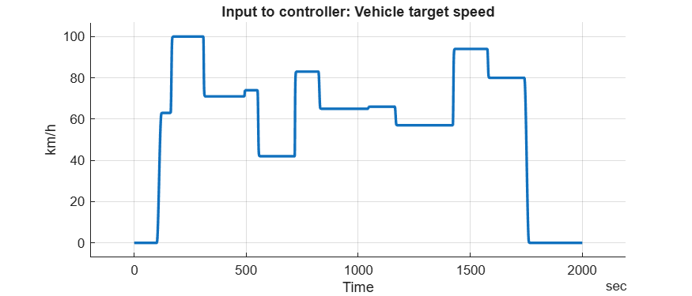
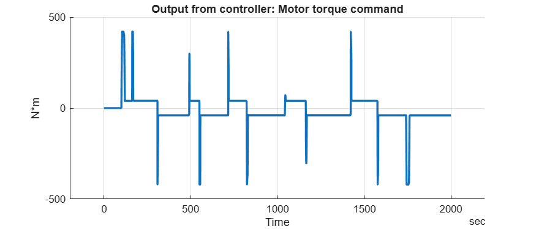

# <span style="color:rgb(213,80,0)">BEV Controller \- Simulation Case</span>

# Simple
```matlab
model_name = "HarnessModel_BEVController";
load_system(model_name) 

BEVController_Basic_params

set_param(model_name + "/BEV Speed Tracking Controller", ReferencedSubsystem = "BEVController_Basic_refsub");

set_param(model_name + "/Inputs", ReferencedSubsystem = "Inputs_BEVController_Random_refsub");
```

```matlab
sim_in = Simulink.SimulationInput(model_name);
sim_in = setModelParameter(sim_in, StopTime = "2000");

sim_out = sim(sim_in);

simResultTimetable = extractTimetable(sim_out.logsout);
```

```matlab
fig = figure;
hold on
grid on
axis padded
fig.Position(3:4) = [700 300];  % width height

plot(simResultTimetable, "Time", "Vehicle speed input kph", LineWidth=2)
title("Input to controller: Vehicle target speed")
ylabel("km/h")
```

<center></center>


```matlab
fig = figure;
hold on
grid on
axis padded
fig.Position(3:4) = [700 300];  % width height

plot(simResultTimetable, "Time", "Motor torque command", LineWidth=2)
title("Output from controller: Motor torque command")
ylabel("N*m")
```

<center></center>


*Copyright 2023\-2025 The MathWorks, Inc.*

