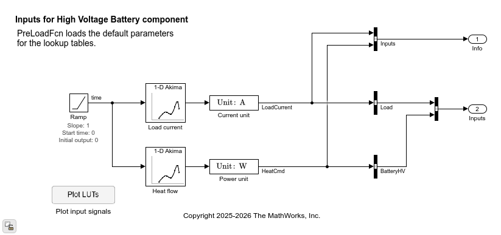
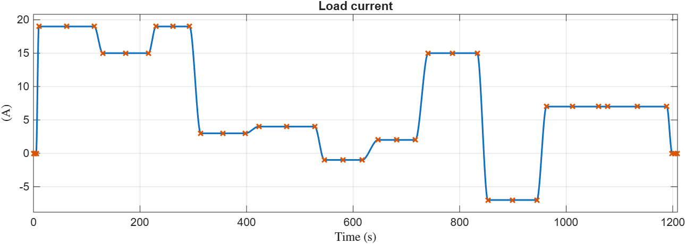
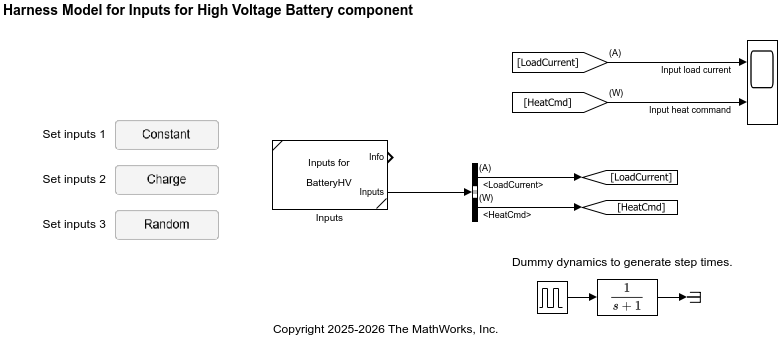

# High Voltage Battery - Inputs for Testing

The `LoadInputs_BatteryHV_*.m` scripts in this folder
load data to the `batteryHV` struct in the base workspace.
The struct is used by lookup table blocks
in the `Inputs_BatteryHV_refsub` Inputs subsystem as input signals.

For example, the Random case (`LoadInputs_BatteryHV_Random`) sets up
the load currnet as follows.

 

In the `HarnessModel_BatteryHV_Inputs` harness model,
the Inputs subsystem is used to test the high voltage battery component,
such as `BatteryHV_Basic_refsub.m` (in the `Model-Basic` folder).

## Test resources

This folder also contains resources to validate
the `LoadInputs_BatteryHV_*.m` scripts and the Inputs subsystem.
The `HarnessModel_BatteryHV_Inputs` model in this folder validates
the Input subsystem for different input signal cases.

_Copyright 2026 The MathWorks, Inc._
