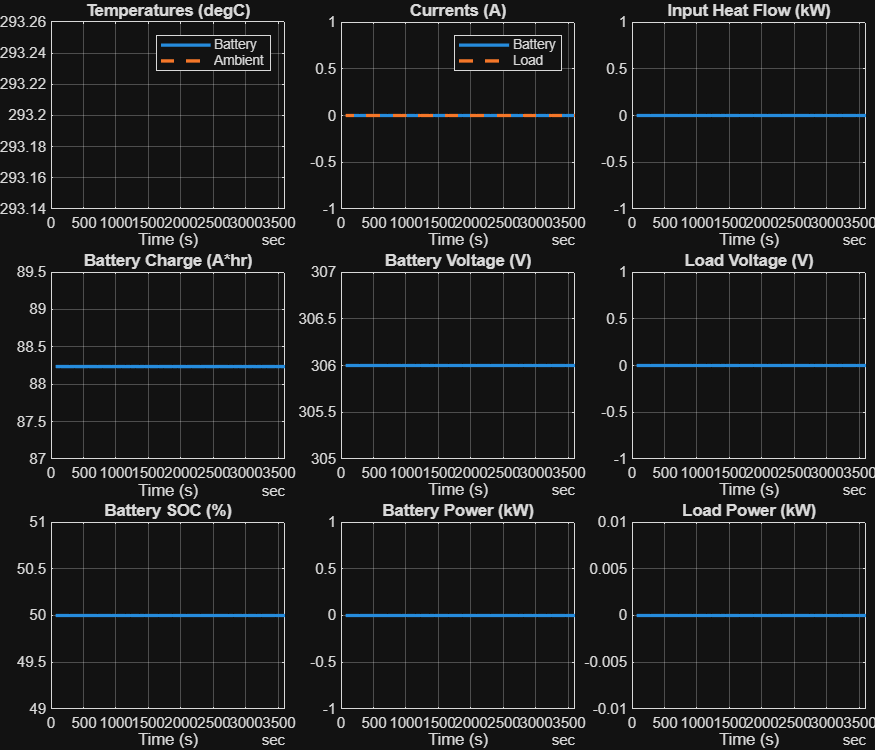

<a id="T_1FFD3858"></a>

# <span style="color:rgb(213,80,0)">High Voltage Battery \- Simulation Case</span>
<a id="H_1B376934"></a>

# Constant inputs

Use this to check that simulation runs ok.

```matlab
model_name = "HarnessModel_BatteryHV";
load_system(model_name)

BatteryHV_Basic_params

set_param(model_name + "/High Voltage Battery", ReferencedSubsystem = "BatteryHV_Basic_refsub");

set_param(model_name + "/Inputs", ReferencedSubsystem = "Inputs_BatteryHV_Constant_refsub");
```

Test conditions

```matlab
% Negative value for charge
testParam.LoadCurrent = simscape.Value(0, "A");
```

Initial conditions

```matlab
initial.hvBattery_SOC_pct = 50;
initial.hvBattery_SOC_normalized = initial.hvBattery_SOC_pct / 100;

tmp_batt_charge = HighVoltageBatteryTool1.getAmpereHourRating( ...
  Capacity = simscape.Value(batteryHV.nominalCapacity_kWh, "kWh"), ...
  Voltage = simscape.Value(batteryHV.nominalVoltage_V, "V"), ...
  StateOfCharge = initial.hvBattery_SOC_normalized );

initial.hvBattery_Charge_Ahr = value(tmp_batt_charge, "Ah");
disp(initial)
```

```matlabTextOutput
           hvBattery_SOC_pct: 50
        hvBattery_Charge_Ahr: 88.2353
     hvBattery_Temperature_K: 293.1500
               ambientTemp_K: 293.1500
    hvBattery_SOC_normalized: 0.5000
```


Simulation

```matlab
sim_in = Simulink.SimulationInput(model_name);
sim_in = setModelParameter(sim_in, StopTime = "3600");

sim_out = sim(sim_in);

logged_signals = extractTimetable(sim_out.logsout);

BatteryHV_plotResults(Timetable = logged_signals);
```

<center></center>


*Copyright 2020\-2025 The Mathworks, Inc.*

