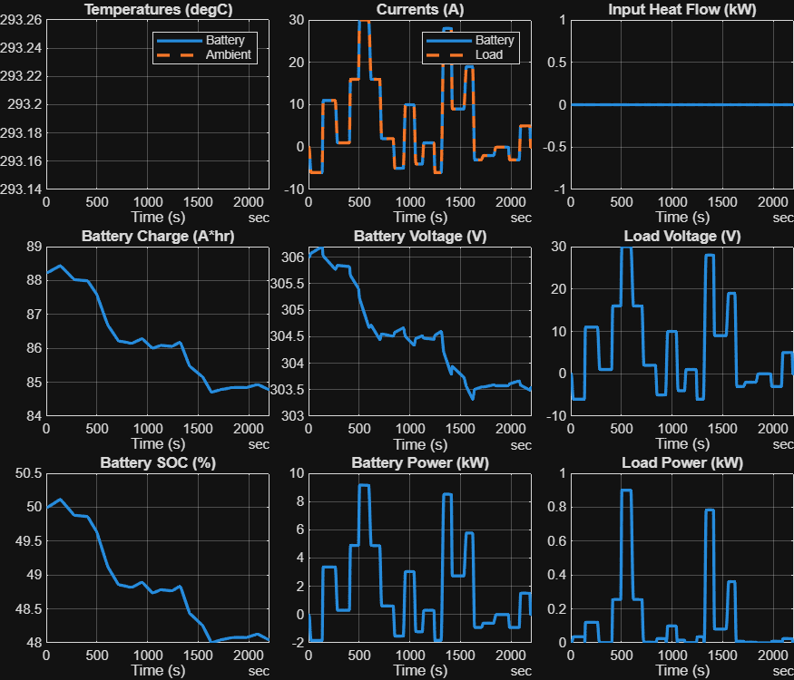

<a id="T_D48C173C"></a>

# <span style="color:rgb(213,80,0)">High Voltage Battery \- Simulation Case</span>
<a id="H_1B376934"></a>

# Random current
```matlab
mdl = "BatteryHV_TestModel";
load_system(mdl)

% Load model parameters.
BatteryHV_TestModelSetup

% Select battery model.
BatteryHV_setRefsub_Basic
```

```matlabTextOutput
Model: BatteryHV_TestModel
Setting up referenced subsystem: BatteryHV_Basic_refsub
```

```matlab
% Setup simulation case.
BatteryHV_setSimCase_Random( ...
  RandomSeed = 125, ...
  NumTransitions = 20, ...
  InitialSOC_pct = 50 );
```

```matlabTextOutput
Setting up simulation...
Simulation case: Random input
Setting simulation stop time to 2206 sec.
Setting block parameters for input blocks...
Setting initial conditions...
initial.hvBattery_SOC_pct = 50
initial.hvBattery_SOC_normalized = 0.5
initial.hvBattery_Charge_Ahr = 88.2353
initial.hvBattery_Temperature_K = 293.15
initial.ambientTemp_K = 293.15
```

```matlab
% Run simulation.
simOut = sim(mdl);

% Collect logged signals and visualize.
% The basic version of the battery block does not simulate battery temperature.
logged_signals = extractTimetable(simOut.logsout);
BatteryHV_ResultsPlot(Timetable=logged_signals);
```

<center></center>


*Copyright 2023\-2025 The MathWorks, Inc.*

