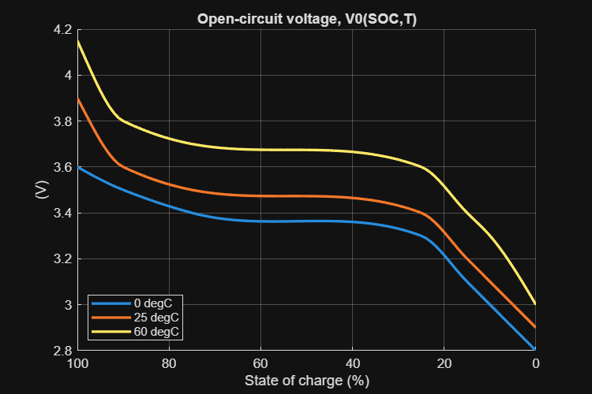
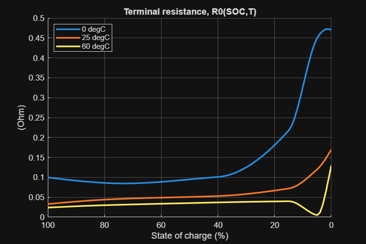

# <span style="color:rgb(213,80,0)">Table\-Based Battery block</span>

This script collects the open\-circuit voltage and terminal voltage parameters of table\-based battery block in a model file and makes the plots of the parameters.

```matlab
% Model to collect parameter values.
model_name = "BatteryHV_SystemTable_refsub";
% Block path to the target battery block.
block_path = "/Battery/Battery (Table-Based)";
```

Collect parameter values from the battery block in the model.

```matlab
full_block_path = model_name + block_path;
BatteryHV_TestModelSetup
load_system(model_name)

% State of charge ... independent variable 1
SOC_normalized = eval(get_param(full_block_path, "SOC_vec"))';
SOC_pct = SOC_normalized * 100;

% Battery temperature ... independent variable 2
T_vec = eval(get_param(full_block_path, "T_vec"));
T_vec_unit = get_param(full_block_path, "T_vec_unit");
TemperatureStr = "" + eval(get_param(full_block_path, "T_vec")) + " " + T_vec_unit;
disp(TemperatureStr)
```

```matlabTextOutput
    "0 degC"    "25 degC"    "60 degC"
```

```matlab

% Open-circuit voltage, V0(SOC,T)
V0_mat = eval(get_param(full_block_path, "V0_mat"));
head(V0_mat)
```

```matlabTextOutput
    2.8000    2.9000    3.0000
    2.8200    2.9200    3.0338
    2.8400    2.9400    3.0672
    2.8600    2.9600    3.1001
    2.8800    2.9800    3.1322
    2.9000    3.0000    3.1635
    2.9200    3.0200    3.1937
    2.9400    3.0400    3.2226
```

```matlab
V0_mat_unit = get_param(full_block_path, "V0_mat_unit");
disp(V0_mat_unit)
```

```matlabTextOutput
V
```

```matlab

% Terminal resistance, R0(SOC,T)
R0_mat = eval(get_param(full_block_path, "R0_mat"));
head(R0_mat)
```

```matlabTextOutput
    0.4700    0.1700    0.1300
    0.4726    0.1582    0.0955
    0.4719    0.1469    0.0614
    0.4679    0.1364    0.0320
    0.4606    0.1273    0.0118
    0.4500    0.1200    0.0050
    0.4342    0.1137    0.0071
    0.4126    0.1074    0.0105
```

```matlab
R0_mat_unit = get_param(full_block_path, "R0_mat_unit");
disp(R0_mat_unit)
```

```matlabTextOutput
Ohm
```

# Open\-ciruit voltage
```matlab
fig = figure;
fig.Position(3:4) = [600 400];
hold on
grid on
for idx = 1 : numel(T_vec)
  plot(SOC_pct, V0_mat(:,idx), LineWidth=2)
end
set(gca, xdir = "reverse")
legend(TemperatureStr, Location="southwest")
xlabel("State of charge (%)")
ylabel("(" + V0_mat_unit + ")")
title("Open-circuit voltage, V0(SOC,T)")
```

<center></center>

# Terminal resistance
```matlab
fig = figure;
fig.Position(3:4) = [600 400];
hold on
grid on
for idx = 1 : numel(T_vec)
  plot(SOC_pct, R0_mat(:,idx), LineWidth=2)
end
set(gca, xdir = "reverse")
legend(TemperatureStr, Location="best")
xlabel("State of charge (%)")
ylabel("(" + R0_mat_unit + ")")
title("Terminal resistance, R0(SOC,T)")
```

<center></center>


*Copyright 2023\-2025 The MathWorks, Inc.*

