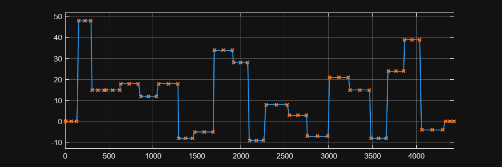
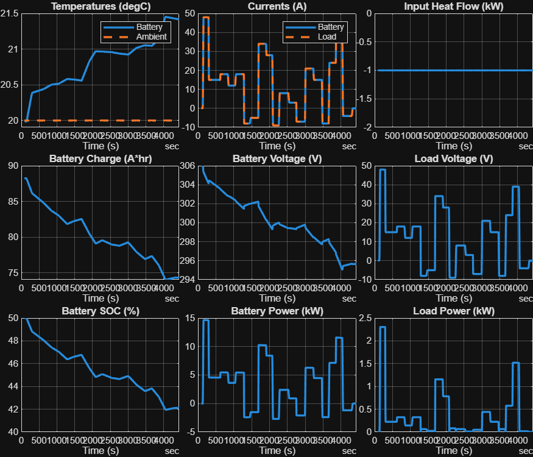

<a id="T_D48C173C"></a>

# <span style="color:rgb(213,80,0)">High Voltage Battery \- Simulation Case</span>
<a id="H_1B376934"></a>

# Random current
```matlab
model_name = "HarnessModel_BatteryHV";
load_system(model_name)

BatteryHV_SystemThermal_params

set_param(model_name + "/High Voltage Battery", ReferencedSubsystem = "BatteryHV_SystemThermal_refsub");

set_param(model_name + "/Inputs", ReferencedSubsystem = "Inputs_BatteryHV_Random_refsub");
```

Test conditions

```matlab
signal_design_matrix = SignalTool2.generateSignalDesignMatrixFromTraceProperties(...
  RandomSeed = 12, ...
  FInitialValue = 0, ...
  XInitialFlatLength = 5, ...
  XInitialTransitionLength = 5, ...
  NumTransitions = 20, ...
  TransitionXRange = [10 30], ...
  FlatXRange = [120 240], ...
  FRange = [-10 50], ...
  XFinalTransitionLength = 30, ...
  XFinalFlatLength = 100, ...
  FFinalValue = 0 );

data_table = SignalTool2.getVectorsFromSignalDesignMatrix(signal_design_matrix);

t = data_table.X;
f = data_table.F;

fig = figure;
fig.Position(3:4) = [900 300];  % width height
SignalTool2.plotLookupTable1D(t, f, InterpolationInterval=0.5, ParentAxes=axes(fig))
```

<center></center>


```matlab
set_param(model_name + "/Inputs/Load current", "Table", CodeTool1.stringify(f))
set_param(model_name + "/Inputs/Load current", "BreakpointsForDimension1", CodeTool1.stringify(t))
```

Initial conditions

```matlab
initial.hvBattery_SOC_pct = 50;
initial.hvBattery_SOC_normalized = initial.hvBattery_SOC_pct / 100;

tmp_batt_charge = HighVoltageBatteryTool1.getAmpereHourRating( ...
  Capacity = simscape.Value(batteryHV.nominalCapacity_kWh, "kWh"), ...
  Voltage = simscape.Value(batteryHV.nominalVoltage_V, "V"), ...
  StateOfCharge = initial.hvBattery_SOC_normalized );

initial.hvBattery_Charge_Ahr = value(tmp_batt_charge, "Ah");
disp(initial)
```

```matlabTextOutput
           hvBattery_SOC_pct: 50
        hvBattery_Charge_Ahr: 88.2353
     hvBattery_Temperature_K: 293.1500
               ambientTemp_K: 293.1500
    hvBattery_SOC_normalized: 0.5000
```


Simulation

```matlab
sim_in = Simulink.SimulationInput(model_name);
sim_in = setModelParameter(sim_in, StopTime = string(t(end)));

sim_out = sim(sim_in);

logged_signals = extractTimetable(sim_out.logsout);

BatteryHV_plotResults(Timetable = logged_signals);
```

<center></center>


*Copyright 2023\-2025 The MathWorks, Inc.*

