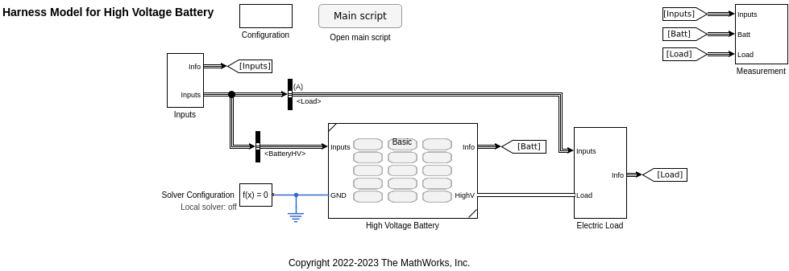

# High Voltage Battery Component

This is a road vehicle component to simulate the abstract dynamics
of a high voltage battery pack.

This component provides four different models of a high voltage battery,
all of which are abstract and run fast.

"**Basic**" model (`BatteryHV_refsub_Basic`) is the simplest model and
computes the voltage and current of the battery
with no temperature dependence.

"**Simple system**" model (`BatteryHV_refsub_SystemSimple`) is
the second simplest model,
built with [Battery (System-Level) block][url-battery-driveline]
from Simscape Driveline.
This model has a simple equation-based terminal voltage model
computed from the state of charge (SOC).
This model computes the battery temperature
from dissipated energy.

[url-battery-driveline]: https://www.mathworks.com/help/sdl/ref/batterysystemlevel.html

"**System**" model (`BatteryHV_refsub_System`) is
a model built with [Battery block][url-battery-elec]
from Simscape Battery and Simscape Electrical.
This model can simulate the terminal voltage more accurately
(using more parameters) than the simple system model above.
Optionally, this model can also simulate charging dynamics, fade, and aging.

[url-battery-elec]: https://www.mathworks.com/help/sps/ref/battery.html

"**Table-based system**" model (`BatteryHV_refsub_SystemTable`) is
a model built with [Battery (Table-Based) block][url-table-battery-elec]
from Simscape Battery and Simscape Electrical.
This model takes tabulated data for
open-circuit voltage and terminal resistance
as a function of temperature and SOC.
This model also needs the number of cells
and their series-parallel circuit configuration information.
Similar to the system model above,
this model can optionally simulate charging dynamics, fade, and aging too.

[url-table-battery-elec]: https://www.mathworks.com/help/sps/ref/batterytablebased.html

## Harness Model

Battery models are provided as [referenced subsystems][url-subref]
to componentize the models.
They are used as a component of Battery Electric Vehicle model
for vehicle system-level simulation,
but they can also be used with a component harness model (`BatteryHV_harness_model`)
to run simulation focusing on the battery model.

[url-subref]: https://www.mathworks.com/help/simulink/ug/referenced-subsystem-1.html

As an example,
the harness model is used in simulation case scripts
(`BatteryHV_simulationCase_*`) in the `SimulationCases` folder
to test the battery models and visually inspect simulation results.

To select a battery model in the harness,
navigate to the **Configuration** subsystem block.

Go to [BEV Project](../README.md).

*Copyright 2022-2023 The MathWorks, Inc.*
