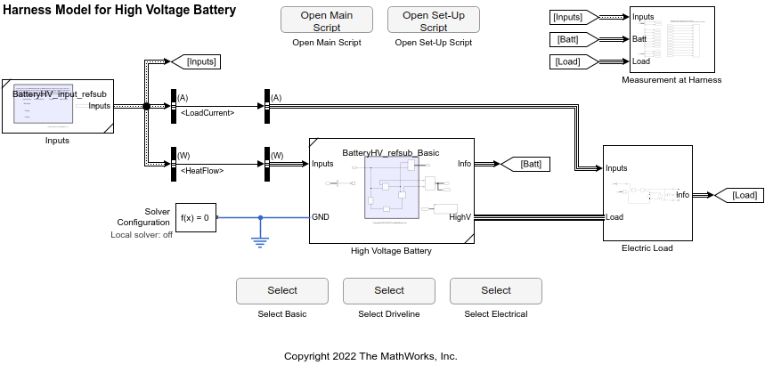
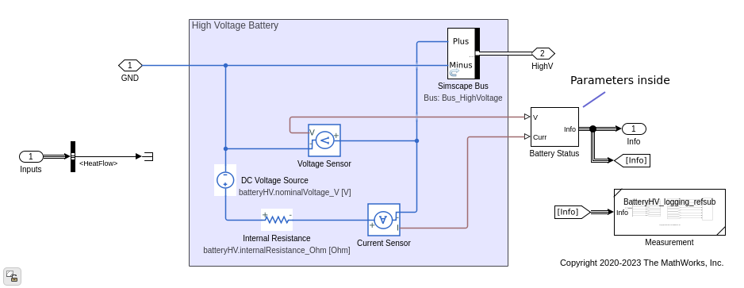

# Component / High Voltage Battery

Component to simulate the electrical
(and optionally thermal) dynamics
of a high voltage battery pack.

The most basic version `BatteryHV_refsub_Basic` computes
the voltage and current of the battery
with no temperature dependence.

To consider the battery temperature,
`BatteryHV_refsub_Driveline` uses
the [Battery block from Simscape Driveline][url-drv-batt].

[url-drv-batt]: https://www.mathworks.com/help/physmod/sdl/ref/batterysystemlevel.html

For more battery behaviors such aging,
`BatteryHV_refsub_Electrical` uses
the [Battery block from Simscape Electrical][url-elec-batt]

[url-elec-batt]: https://www.mathworks.com/help/physmod/sps/ref/battery.html

## Harness Model

## Main Component Subsystem

Basic version

*Copyright 2022 The MathWorks, Inc.*
