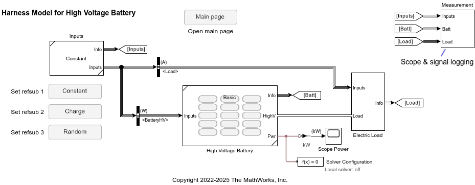

# High Voltage Battery Component

This is a road vehicle component to simulate the abstract dynamics
of a high voltage battery pack.

This component provides several models of a high voltage battery,
all of which are abstract and run fast.

**Primitive** model (`BatteryHV_Primitive_refsub`) is the simplest model and
computes the voltage and current of the battery
with no temperature dependence.

**Basic** model (`BatteryHV_Basic_refsub`) is
built with [Battery (System-Level) block][url-battery-driveline]
from Simscape Driveline.
This model has a simple equation-based terminal voltage model
computed from the state of charge (SOC).
This model does not compute the battery temperature.

[url-battery-driveline]: https://www.mathworks.com/help/sdl/ref/batterysystemlevel.html

**BasicThermal** model (`BatteryHV_BasicThermal_refsub`) is
the same as the Basic model except that the battery temperature is computed.

**SystemThermal** model (`BatteryHV_SystemThermal_refsub`) is
built with [Battery block][url-battery-elec]
from Simscape Battery and Simscape Electrical.
This model can simulate the terminal voltage more accurately
(using more parameters) than the simple system model above.
Optionally, this model can also simulate charging dynamics, fade, and aging.

[url-battery-elec]: https://www.mathworks.com/help/sps/ref/battery.html

**SystemTable** model (`BatteryHV_SystemTable_refsub`) is
built with [Battery (Table-Based) block][url-table-battery-elec]
from Simscape Battery and Simscape Electrical.
This model takes tabulated data for
open-circuit voltage and terminal resistance
as a function of temperature and SOC.
Battery temperature is computed.
This model also needs the number of cells
and their series-parallel circuit configuration information.
Similar to the SystemThermal model,
this model can optionally simulate charging dynamics, fade, and aging too.

[url-table-battery-elec]: https://www.mathworks.com/help/sps/ref/batterytablebased.html

## Harness Model

Battery models are provided as [referenced subsystems][url-subref]
to componentize the models.
They are used as a component of Battery Electric Vehicle model
for vehicle system-level simulation,
but they can also be used with a component test model (`HarnessModel_BatteryHV`)
to run simulation focusing on the battery model.

The harness model is used in simulation case scripts
in the `SimulationCases` folder in each model folder.

[url-subref]: https://www.mathworks.com/help/simulink/ug/referenced-subsystem-1.html

*Copyright 2022-2025 The MathWorks, Inc.*
