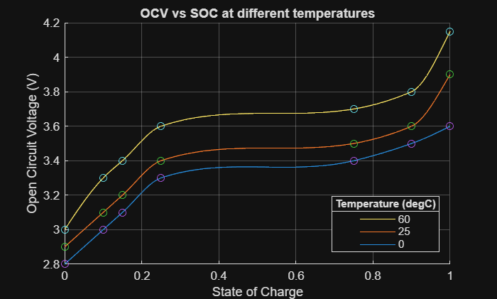

# <span style="color:rgb(213,80,0)">refineOCVData sample script</span>

Run the function without any arguments. It uses default inputs and returns a result.

```matlab
data = HighVoltageBatteryTool1.refineOCVData;
head(data, 3)
```

```matlabTextOutput
    SOC                 OCV             
    ____    ____________________________

       0     2.8       2.9         3 (V)
    0.01    2.82      2.92    3.0338 (V)
    0.02    2.84      2.94    3.0672 (V)
```

```matlab
tail(data, 3)
```

```matlabTextOutput
    SOC                  OCV              
    ____    ______________________________

    0.98    3.5777    3.8239    4.0604 (V)
    0.99    3.5888    3.8621    4.1054 (V)
       1       3.6       3.9      4.15 (V)
```

```matlab
disp(data.Properties.CustomProperties.OCVTemperature)
```

```matlabTextOutput
     0    25    60

    (degC)
```


Assume you have OCV data measured at different temperatures.

```matlab
Temp = simscape.Value([0, 25, 60], "degC");
SOC_data = [0; 0.1; 0.15; 0.25; 0.75; 0.9; 1];
OCV_data = simscape.Value( ...
  [2.8, 2.9, 3.0; 3.0, 3.1, 3.3; 3.1, 3.2, 3.4; 3.3, 3.4, 3.6; 3.4, 3.5, 3.7; 3.5, 3.6, 3.8; 3.6, 3.9, 4.15], ...
  "V");
```

Refine the data.

```matlab
SOC_refine_interval = 0.01;

data = HighVoltageBatteryTool1.refineOCVData( ...
  Temperature = Temp, ...
  SOC = SOC_data, ...
  SOCInterval = SOC_refine_interval, ...
  OCV = OCV_data );

ocvTemp = data.Properties.CustomProperties.OCVTemperature;

fig = figure;
ax = axes(fig);
hold(ax, "on")
plot(ax, data.SOC, value(data.OCV));
scatter(ax, SOC_data, value(OCV_data));
grid(ax, "on");
xlabel(ax, "State of Charge");
ylabel(ax, "Open Circuit Voltage (" + string(unit(data.OCV)) + ")");
title(ax, "OCV vs SOC at different temperatures");
leg = legend(ax, string(value(ocvTemp)), Direction="reverse", Location="best");
title(leg, "Temperature (" + string(unit(ocvTemp)) + ")")
```

<center></center>


*Copyright 2025 The MathWorks, Inc.*

