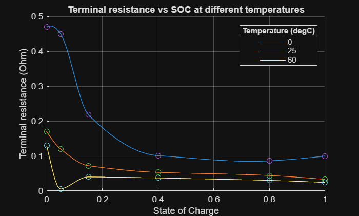

# <span style="color:rgb(213,80,0)">refineTerminalResistanceData sample script</span>

Run the function without any arguments. It uses default inputs and returns a result.

```matlab
data = HighVoltageBatteryTool1.refineTerminalResistanceData;
head(data, 3)
```

```matlabTextOutput
    SOC              TerminalResistance          
    ____    _____________________________________

       0       0.47        0.17        0.13 (Ohm)
    0.01    0.47258     0.15822    0.095488 (Ohm)
    0.02     0.4719     0.14687     0.06137 (Ohm)
```

```matlab
tail(data, 3)
```

```matlabTextOutput
    SOC               TerminalResistance          
    ____    ______________________________________

    0.98    0.098085     0.03431    0.024691 (Ohm)
    0.99    0.099027    0.033658    0.024346 (Ohm)
       1         0.1       0.033       0.024 (Ohm)
```

```matlab
disp(data.Properties.CustomProperties.TerminalResistanceTemperature)
```

```matlabTextOutput
     0    25    60

    (degC)
```


Assume you have OCV data measured at different temperatures.

```matlab
Temp = simscape.Value([0, 25, 60], "degC");
SOC_data = [0; 0.05; 0.15; 0.4; 0.8; 1];
TerminalResistance_data = simscape.Value( ...
  [0.47 0.17 0.13; 0.45 0.12 0.005; 0.218 0.072 0.04; 0.101 0.053 0.037; 0.086 0.044 0.03; 0.1 0.033 0.024], ...
  "Ohm");
```

Refine the data.

```matlab
SOC_refine_interval = 0.01;

data = HighVoltageBatteryTool1.refineTerminalResistanceData( ...
  Temperature = Temp, ...
  SOC = SOC_data, ...
  SOCInterval = SOC_refine_interval, ...
  TerminalResistance = TerminalResistance_data );

r0Temp = data.Properties.CustomProperties.TerminalResistanceTemperature;

fig = figure;
ax = axes(fig);
hold(ax, "on")
plot(ax, data.SOC, value(data.TerminalResistance));
scatter(ax, SOC_data, value(TerminalResistance_data));
grid(ax, "on");
xlabel(ax, "State of Charge");
ylabel(ax, "Terminal resistance (" + string(unit(data.TerminalResistance)) + ")");
title(ax, "Terminal resistance vs SOC at different temperatures");
leg = legend(ax, string(value(r0Temp)), Location="best");
title(leg, "Temperature (" + string(unit(r0Temp)) + ")")
```

<center></center>


*Copyright 2025 The MathWorks, Inc.*

