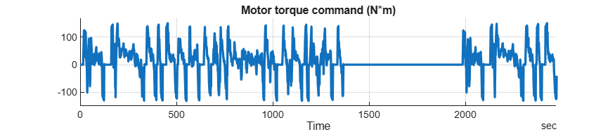
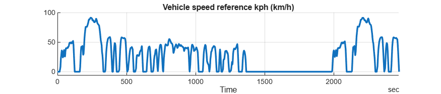
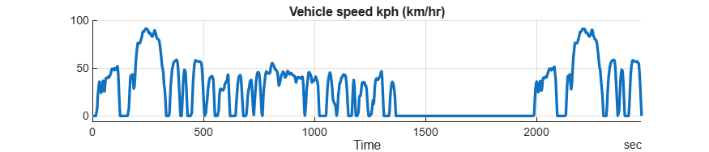
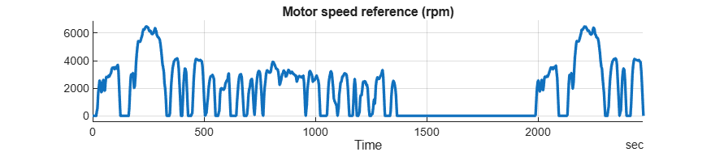
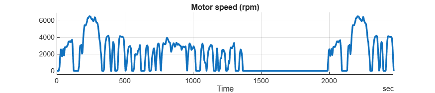

# <span style="color:rgb(213,80,0)">Controller and Environment \- Simulation Case</span>
```matlab
model_name = "HarnessModel_CtrlEnv";
load_system(model_name)


HarnessSetup_CtrlEnv


sim_in = Simulink.SimulationInput(model_name);


sim_in = setBlockParameter(sim_in, ...
  model_name + "/Controller and Environment/Vehicle speed reference", ...
  ReferencedSubsystem = "VehSpdRef_FTP75_refsub");


sim_in = setModelParameter(sim_in, StopTime = "2474");


applyToModel(sim_in)


sim_out = sim(sim_in);


sim_data = extractTimetable(sim_out.logsout);


% Specify the signal logging names in the model.
signal_names = [
  "Motor torque command"
  "Vehicle speed reference kph"
  "Vehicle speed kph"
  "Motor speed reference"
  "Motor speed"
  ];


for idx = 1 : numel(signal_names)
  SignalUtil1.plotTimedData( TimedData = sim_data, ...
    SignalName = signal_names(idx), ...
    FigureHeight = 150 )
end  % for
```

<center></center>

<center></center>

<center></center>

<center></center>

<center></center>

*Copyright 2023\-2026 The MathWorks, Inc.*