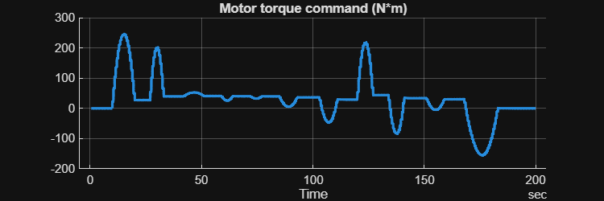
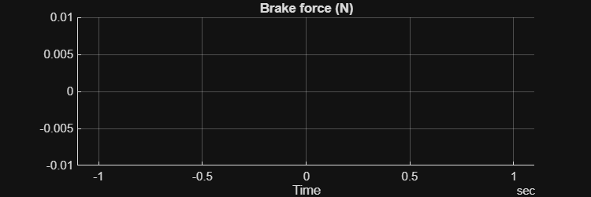
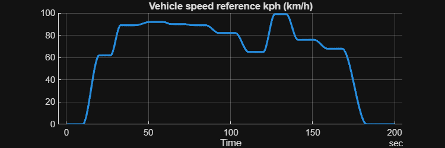
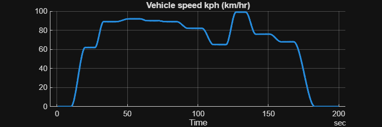
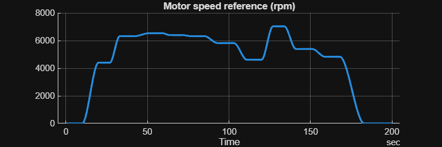
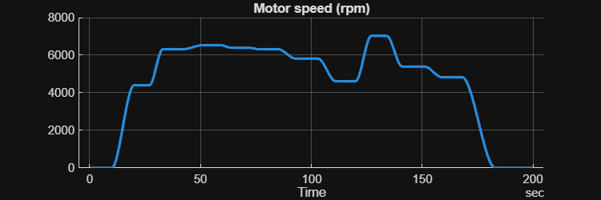
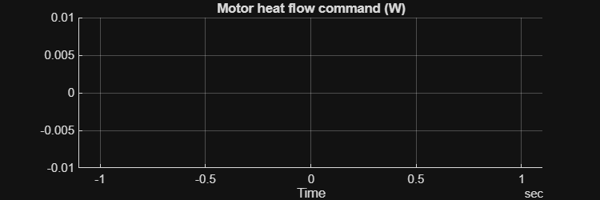
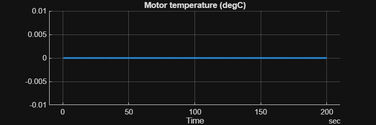
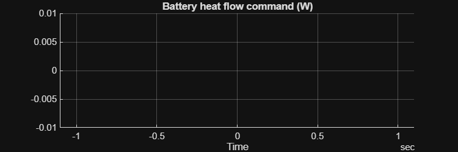
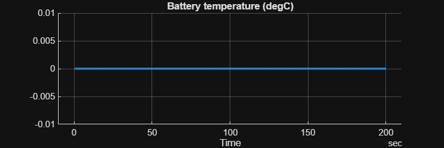

# <span style="color:rgb(213,80,0)">Controller and Environment \- Simulation Case</span>
```matlab
mdl = "CtrlEnv_TestModel";
load_system(mdl)
CtrlEnv_TestModelSetup
CtrlEnv_setSimCase_HighSpeed
```

```matlabTextOutput
Setting up simulation...
Simulation case: High speed driving
Setting simulation stop time to 200 sec.
Selecting simulation case 2.
```

```matlab
simOut = sim(mdl);
```

```matlab
simData = extractTimetable(simOut.logsout);
CtrlEnv_ResultsPlot( SimData = simData, ...
  FigureHeight = 200 );
```

<center></center>


<center></center>


<center></center>


<center></center>


<center></center>


<center></center>


<center></center>


<center></center>


<center></center>


<center></center>


*Copyright 2023\-2025 The MathWorks, Inc.*

