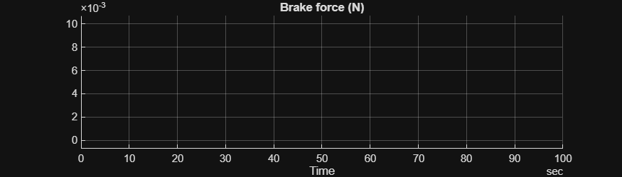
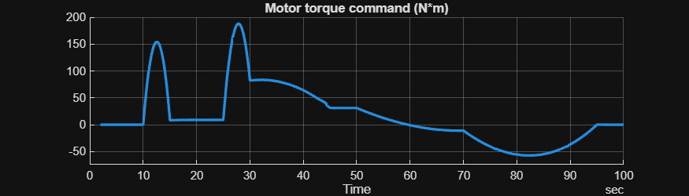
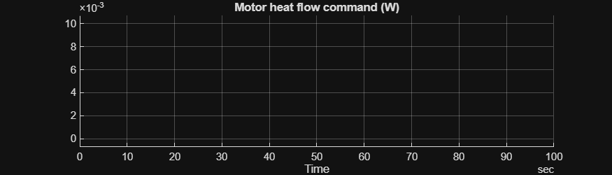
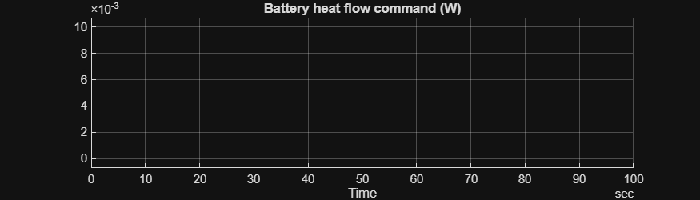
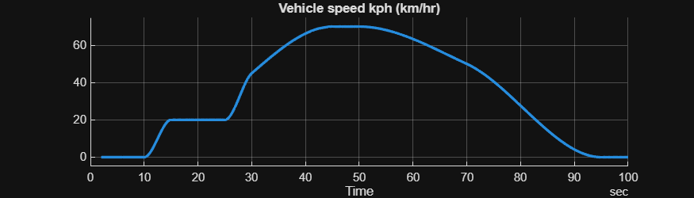
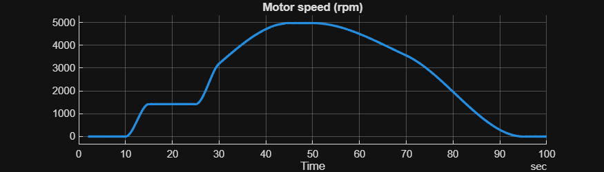
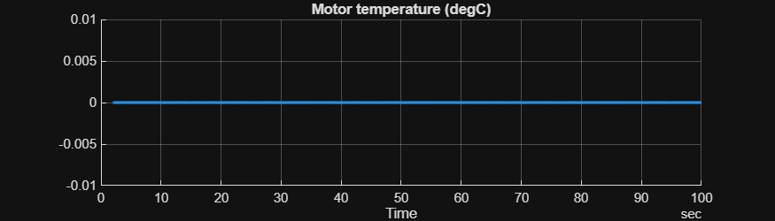
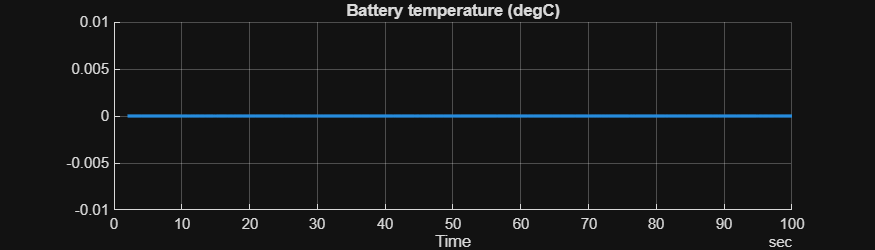

# <span style="color:rgb(213,80,0)">Controller and Environment \- Simulation Case</span>
```matlab
model_name = "HarnessModel_CtrlEnv";
load_system(model_name)

HarnessSetup_CtrlEnv

sim_in = Simulink.SimulationInput(model_name);

sim_in = setBlockParameter(sim_in, ...
  model_name + "/Controller and Environment/Vehicle speed reference", ...
  ReferencedSubsystem = "VehSpdRef_Simple_refsub");

sim_in = setModelParameter(sim_in, StopTime = "100");

applyToModel(sim_in)

sim_out = sim(sim_in);

sim_data = extractTimetable(sim_out.logsout);

% Specify the signal logging names in the model.
signal_names = [
  "Brake force"
  "Motor torque command"
  "Motor heat flow command"
  "Battery heat flow command"
  "Vehicle speed kph"
  "Motor speed"
  "Motor temperature"
  "Battery temperature"
  ];

for idx = 1 : numel(signal_names)
  SignalTool3.plotTimedData( TimedData = sim_data, ...
    SignalName = signal_names(idx), ...
    FigureHeight = 200 )
end  % for
```

<center></center>


<center></center>


<center></center>


<center></center>


<center></center>


<center></center>


<center></center>


<center></center>


*Copyright 2023\-2025 The MathWorks, Inc.*

