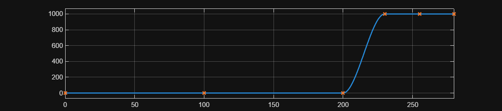
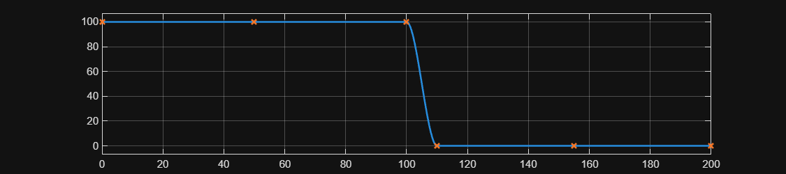
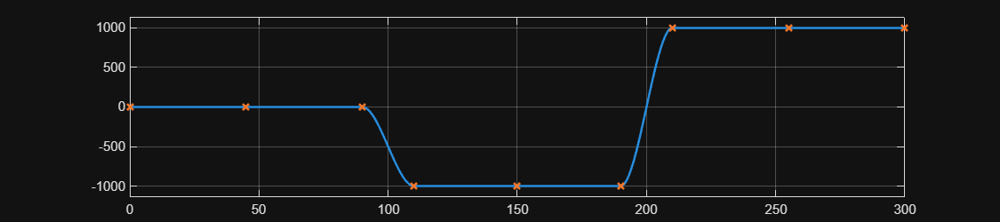

# <span style="color:rgb(213,80,0)">Build inputs</span>

Generate data.

```matlab
BrakeForce.DesignMatrix = [0 200 0; 230 280 1000];
BrakeForce.DataTable = SignalUtil1.getVectorsFromSignalDesignMatrix(BrakeForce.DesignMatrix);
BrakeForce.t = BrakeForce.DataTable.X;
BrakeForce.f = BrakeForce.DataTable.F;
fig = figure;
fig.Position(3:4) = [900 200];  % width height
SignalUtil1.plotLookupTable1D(BrakeForce.t, BrakeForce.f, InterpolationInterval=0.2, ParentAxes=axes(fig))
```

<center></center>


```matlab
MotorTorqueCommand.DesignMatrix = [0 100 100; 110 200 0];
MotorTorqueCommand.DataTable = SignalUtil1.getVectorsFromSignalDesignMatrix(MotorTorqueCommand.DesignMatrix);
MotorTorqueCommand.t = MotorTorqueCommand.DataTable.X;
MotorTorqueCommand.f = MotorTorqueCommand.DataTable.F;
fig = figure;
fig.Position(3:4) = [900 200];  % width height
SignalUtil1.plotLookupTable1D(MotorTorqueCommand.t, MotorTorqueCommand.f, InterpolationInterval=0.2, ParentAxes=axes(fig))
```

<center></center>


```matlab
MotorHeatFlowCommand.DesignMatrix = [0 90 0; 110 190 -1000; 210 300 1000];
MotorHeatFlowCommand.DataTable = SignalUtil1.getVectorsFromSignalDesignMatrix(MotorHeatFlowCommand.DesignMatrix);
MotorHeatFlowCommand.t = MotorHeatFlowCommand.DataTable.X;
MotorHeatFlowCommand.f = MotorHeatFlowCommand.DataTable.F;
fig = figure;
fig.Position(3:4) = [900 200];  % width height
SignalUtil1.plotLookupTable1D(MotorHeatFlowCommand.t, MotorHeatFlowCommand.f, InterpolationInterval=0.2, ParentAxes=axes(fig))
```

<center></center>


```matlab
BatteryHeatFlowCommand.DesignMatrix = [0 90 0; 110 190 -1000; 210 300 1000];
BatteryHeatFlowCommand.DataTable = SignalUtil1.getVectorsFromSignalDesignMatrix(BatteryHeatFlowCommand.DesignMatrix);
BatteryHeatFlowCommand.t = BatteryHeatFlowCommand.DataTable.X;
BatteryHeatFlowCommand.f = BatteryHeatFlowCommand.DataTable.F;
fig = figure;
fig.Position(3:4) = [900 200];  % width height
SignalUtil1.plotLookupTable1D(BatteryHeatFlowCommand.t, BatteryHeatFlowCommand.f, InterpolationInterval=0.2, ParentAxes=axes(fig))
```

<center></center>


Set the generated data to the target block in the target model.

```matlab
model_name = "HarnessModel_CtrlEnv_Vehicle";
load_system(model_name)

% Target blocks are Simulink 1D Lookup Tables.
block_path = model_name + "/Brake force";
set_param(block_path, "Table", CodeUtil1.stringify(BrakeForce.f))
set_param(block_path, "BreakpointsForDimension1", CodeUtil1.stringify(BrakeForce.t))

block_path = model_name + "/Motor torque command";
set_param(block_path, "Table", CodeUtil1.stringify(MotorTorqueCommand.f))
set_param(block_path, "BreakpointsForDimension1", CodeUtil1.stringify(MotorTorqueCommand.t))

block_path = model_name + "/Motor heat flow command";
set_param(block_path, "Table", CodeUtil1.stringify(MotorHeatFlowCommand.f))
set_param(block_path, "BreakpointsForDimension1", CodeUtil1.stringify(MotorHeatFlowCommand.t))

block_path = model_name + "/Battery heat flow command";
set_param(block_path, "Table", CodeUtil1.stringify(BatteryHeatFlowCommand.f))
set_param(block_path, "BreakpointsForDimension1", CodeUtil1.stringify(BatteryHeatFlowCommand.t))
```

*Copyright 2025 The MathWorks, Inc.*

