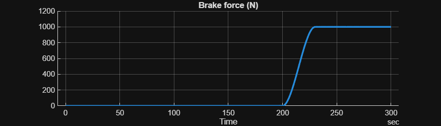
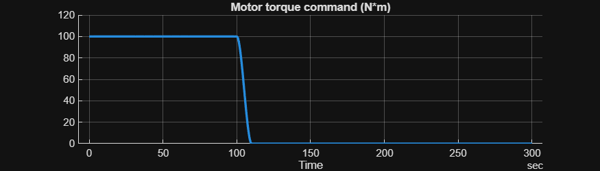
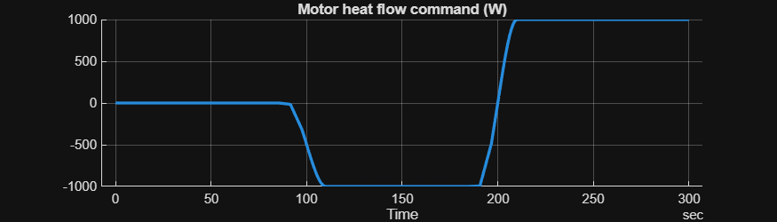
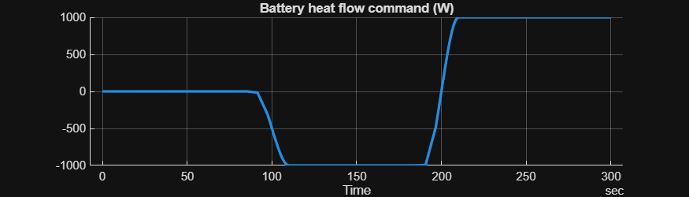
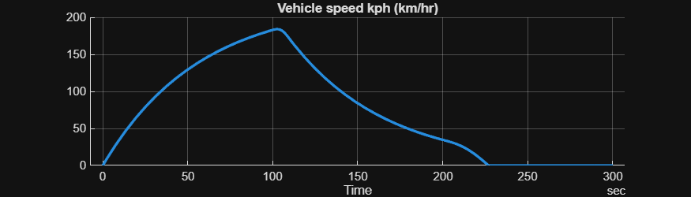
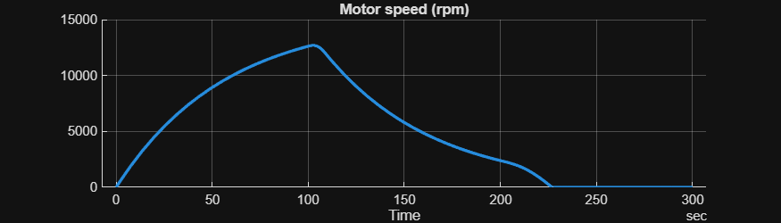
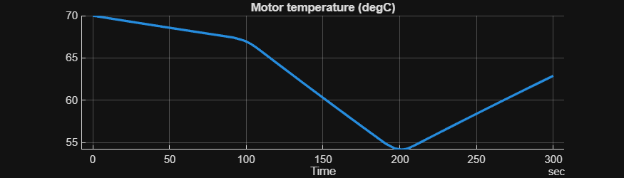
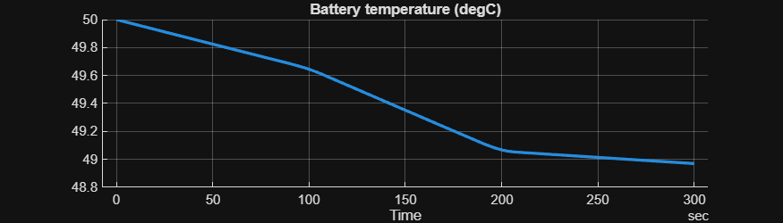

# <span style="color:rgb(213,80,0)">Simplistic Vehicle \- Simulation Case</span>

Note that vehicle dynamics and temperature dynamics are isolated from each other in the model, and it is intentional.

```matlab
mdl = "HarnessModel_CtrlEnv_Vehicle";
load_system(mdl)

HarnessSetup_CtrlEnv_Vehicle

% CtrlEnv_Vehicle_setSimCase
initial.VehicleSpeed_kph = 0;

TireRollingRadius_m = 0.35;
GearRatio = 9.1;

initial.VehicleInertiaSpd_rpm = CtrlEnv_Vehicle_getMotorSpeedFromVehicleSpeed( ...
  VehicleSpeed_kph = initial.VehicleSpeed_kph, ...
  TireRollingRadius_m = TireRollingRadius_m, ...
  GearRatio = GearRatio );

initial.MotorTemperature_K = 273.15 + 70;
initial.BatteryTemperature_K = 273.15 + 50;

initial.MotorAmbientTemperature_K = 273.15 + 20;
initial.BatteryAmbientTemperature_K = initial.MotorAmbientTemperature_K;

sim_in = Simulink.SimulationInput(mdl);
sim_in = setModelParameter(sim_in, StopTime = "300");

sim_out = sim(sim_in);
result = extractTimetable(sim_out.logsout);

CtrlEnv_Vehicle_plotSimulationResults( ...
  SimData = result, ...
  FigureHeight = 200 );
```

<center></center>


<center></center>


<center></center>


<center></center>


<center></center>


<center></center>


<center></center>


<center></center>


*Copyright 2023\-2025 The MathWorks, Inc.*

