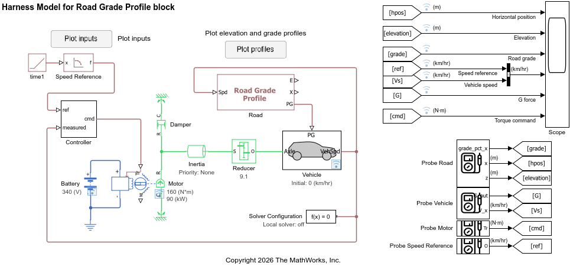

# Elevation Profile

The Elevation Profile component provides the height of the road surface
as a function of horizontal position.

Given road grade $G$ (in percent), road incline angle $\theta$ is computed as follows.

$$ \theta = \textrm{atan} ( G/100 ) $$

Given curvilinear position $s$ which is the longitudinal direction of the vehicle,
horizontal position $x$ and elevation $E$ are computed as follows.

$$ x = s \cdot \cos ( \theta ) $$

$$ E = s \cdot \sin ( \theta ) $$

For example, 100 unit distance (e.g., meters or feet) in the curvilinear distance $s$
corresponds to the following horizontal distances for various road grades.

| Grade $G$ (%) | Horizontal position $x$ | Elevation $E$ |
|---------------|-------------------------|---------------|
| 0 | 100 | 0 |
| 1 | 99.995 | 0.99995 |
| 5 | 99.875 | 4.9938 |
| 10 | 99.504 | 9.9504 |
| 30 | 95.783 | 28.735 |

## Harness model for Road Grade Profile block

The Elevation Profile component provides the Road Grade Profile block,
which is a custom Simscape component.
The harness model to test the Elevation Profile component is built with this custom component.

## FYI: Road Profile block

The [Road Profile block][roadprofile] in Simscape Driveline works with
the [Vehicle Body block][vehiclebody].
The Road Profile works in a similar manner with the Road Grade Profile block
to feed the road incline data to the vehicle,
but the Road Profile block computes the incline angle dynamically
during simulation whereas the Road Grade Profile block takes the grade profile
as a parameter which predetermines the angle.

[roadprofile]: https://www.mathworks.com/help/sdl/ref/roadprofile.html 
[vehiclebody]: https://www.mathworks.com/help/sdl/ref/vehiclebody.html

_Copyright 2026 The MathWorks, Inc._
