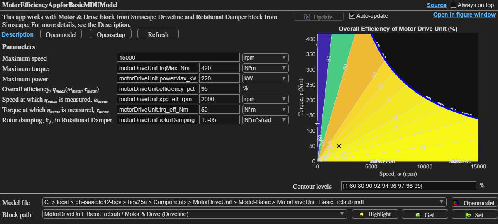

# Motor Drive Unit Basic Model

## Description

This folder contains a `Basic` version of a Motor Drive Unit (MDU)
as [a referenced subsystem][doc-refsub] component.
To run simulation, use a test model provided with this component.

- Referenced subsystem file: `MotorDriveUnit_Basic_refsub.mdl`
- Parameter file: `MotorDriveUnit_Basic_params.m`

The primary block of this component is
[Motor & Drive block][doc-motor-drive] from
Simscape Driveline.

[doc-refsub]: https://www.mathworks.com/help/simulink/ug/create-and-use-referenced-subsystems-in-models-using-subsystem-reference.html
[doc-motor-drive]: https://www.mathworks.com/help/sdl/ref/motordrive.html

## Efficiency app

Use the app `MotorDriveUnit_BasicModelEfficiencyApp` to see
the map of electro-mechanical power conversion efficiency.

## Simulation cases

A few simulation cases are provided in the `SimulationCases` folder
to demonstrate the model behaviors.
They also serve as simple test cases including stress tests.

_Copyright 2025 The MathWorks, Inc._
