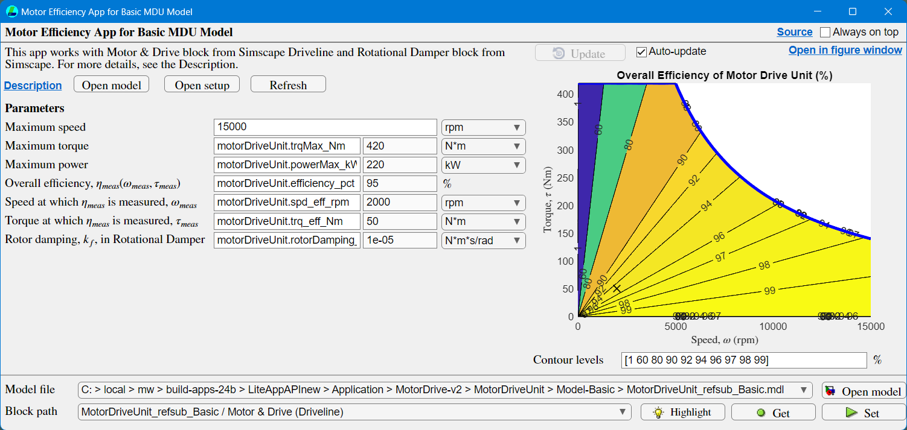

# Motor Drive Unit Basic Model

## Description

This folder contains a `Basic` version of a Motor Drive Unit (MDU)
as [a referenced subsystem][doc-refsub] component.
To run simulation, use a harness model provided with this component.

- Referenced subsystem file: `MotorDriveUnit_refsub_Basic.mdl`
- Parameter file: `MotorDriveUnit_refsub_Basic_params.m`

The primary block of this component is
[Motor & Drive block][doc-motor-drive] from
Simscape Driveline.

[doc-refsub]: https://www.mathworks.com/help/simulink/ug/create-and-use-referenced-subsystems-in-models-using-subsystem-reference.html
[doc-motor-drive]: https://www.mathworks.com/help/sdl/ref/motordrive.html

## Efficiency app

Use the app `MotorDriveUnitEfficiencyApp_Basic` to see
the map of electro-mechanical power conversion efficiency.

## Simulation cases

A few simulation cases are provided in the `SimulationCases` folder
to demonstrate the model behaviors.
They also serve as simple test cases including stress tests.

## Testing and quality assurance

The component is tested using [MATLAB Unit Testing framework][doc-test].

- Some tests simply run scripts, functions, classes, or models.
  This is to ensure that they all run without errors right out of the box.
  This type of test is sometimes called "smoke test", but
  it is called Minimum Quality Check (MQC) in this project.
  MQC tests are meant to be used in day-to-day development
  in a short iteration cycle, and they are designed to finish quickly.

- The [buildtool][doc-buildtool] command with `buildfile.m` detects
  test code files, runs them, and generates test report and
  code coverage report. The buildtool also performs
  [MATLAB code analysis using Code Analyzer][doc-codeissues].
  See `buildfile.m` in this project for how the buildtool is configured.

[doc-test]: https://www.mathworks.com/help/matlab/matlab_prog/class-based-unit-tests.html
[doc-buildtool]: https://www.mathworks.com/help/matlab/ref/buildtool.html
[doc-codeissues]: https://www.mathworks.com/help/matlab/ref/matlab.buildtool.tasks.codeissuestask-class.html

## FYI: Test automation

With test code files in place, test automation is possible
using remote source control services
such as [GitHub Actions][doc-github-actions] or [GitLab CI][doc-gitlab-ci].
These services can run tests automatically
whenever changes are pushed to the repository.
With GitHub Actions, you can run MATLAB code files and Simulink models
using [MATLAB Actions][doc-mlactions] in public GitHub repository.

As a working example of test automation, see for example
[Simscape Battery Electric Vehicle Model][url-bev] repository,
especially the YML files in the `.github/workflows` folder.

[doc-github-actions]: https://docs.github.com/en/actions
[doc-gitlab-ci]: https://docs.gitlab.com/ci/
[doc-mlactions]: https://github.com/matlab-actions
[url-bev]: https://github.com/mathworks/Simscape-Battery-Electric-Vehicle-Model

_Copyright 2025 The MathWorks, Inc._
