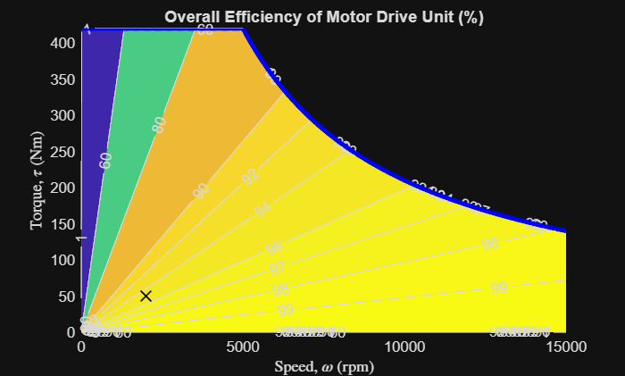

# <span style="color:rgb(213,80,0)">Efficiency Map of Motor Drive Unit</span>

This script collects block parameters from the Basic model of Motor Drive Unit component and makes a plot of motor efficiency contour map.

# Basic model
```matlab
mdl = "MotorDriveUnit_Basic_refsub";
MotorDriveUnit_Basic_params
load_system(mdl)
blkpath = mdl + "/Motor & Drive (Driveline)";
info = MotorDriveUnit_getBasicModelBlockInfo(blkpath);
disp(info)
```

```matlabTextOutput
                         MaxTorque: 420 (N*m)
                          MaxPower: 220 (kW)
                      ResponseTime: 0.0200 (s)
                 EfficiencyPercent: 95 (1)
                     MeasuredSpeed: 2000 (rpm)
                    MeasuredTorque: 50 (N*m)
    MechanicalPower_measurement_kW: 10.4720
               MeasuredNominalLoss: 551.1566 (W)
                  MeasuredIronLoss: 55.1157 (W)
                MeasuredCopperLoss: 496.0409 (W)
```


The Basic model has a rotor damper block, whose damping parameter can be passed to the plot function to make a more accurate efficiency plot.

```matlab
RotorDamping = ModelTool1.getSimscapeValueFromBlockParameter( mdl+"/Rotor damper", "D" );
disp(RotorDamping)
```

```matlabTextOutput
1.0000e-05 (N*m*s/rad)
```

```matlab

fig = MotorDriveUnit_BasicModelEfficiencyPlot( ...
  ... In road vehicle applications,
  ... maximum motor speed is determined by vehicle top speed,
  ... tire rolling radius, and reduction gear ratio. 
  MaxSpeed = simscape.Value(15000, "rpm"), ...
  ...
  MaxTorque = info.MaxTorque, ...
  MaxPower = info.MaxPower, ...
  EfficiencyPercent = info.EfficiencyPercent, ...
  MeasuredSpeed = info.MeasuredSpeed, ...
  MeasuredTorque = info.MeasuredTorque, ...
  RotorDamping = RotorDamping, ...
  ContourLevelsPercent = simscape.Value([1 60 80 90 92 94 96 97 98 99], "1"), ...
  PlotResolution = 500 );
```

<center></center>


Save the plot to a PNG file. 

```matlab
% exportgraphics(fig, "tmp-plot.png")
```

*Copyright 2021\-2025 The MathWorks, Inc.*

