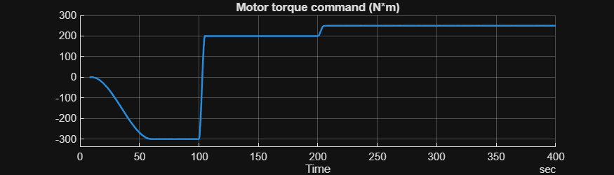
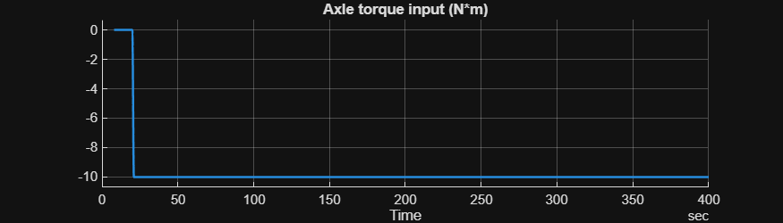
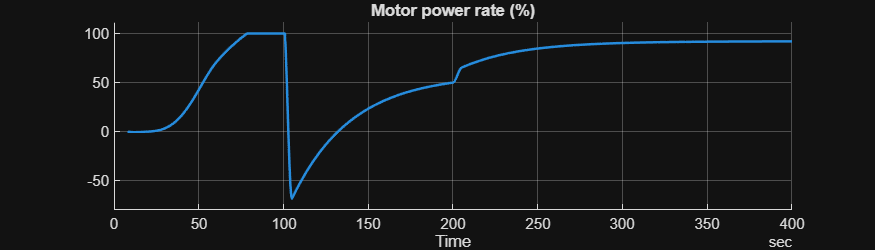
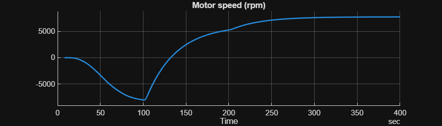
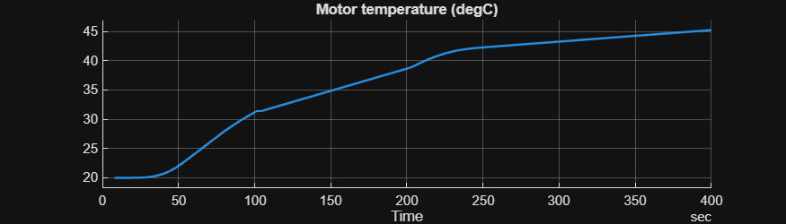
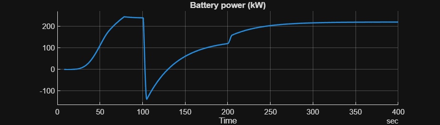
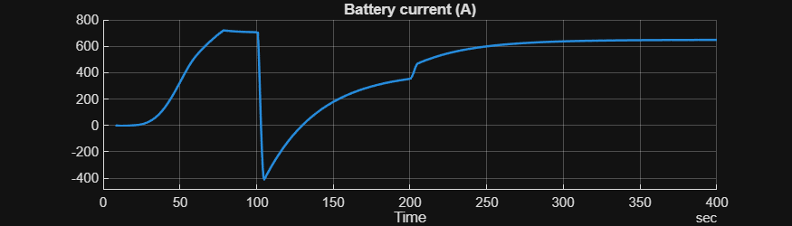
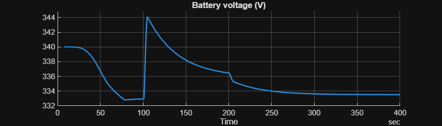

# <span style="color:rgb(213,80,0)">Motor Drive Unit \- Simulation Case</span>

# Driving motor

Test that the motor can drive the axle. Stress\-test check points

1.  Simulation must work regardless of the rotational direction.
2. A sudden change in the rotational direction must be handled reasonably.
```matlab
mdl = "MotorDriveUnit_TestModel";
load_system(mdl)
MotorDriveUnit_TestModelSetup
```

Select model to use.

```matlab
MotorDriveUnit_setRefsub_BasicThermal
```

```matlabTextOutput
Model: MotorDriveUnit_TestModel
Setting up referenced subsystem: MotorDriveUnit_BasicThermal_refsub
```


Load simulation case.

```matlab
MotorDriveUnit_setSimCase_Drive
```

```matlabTextOutput
Setting up simulation...
Simulation case: Drive motor
Setting simulation stop time to 400 sec.
Setting block parameters...
batteryHV.nominalVoltage_V = 340
batteryHV.internalResistance_Ohm = 0.01
Setting initial conditions...
initial.loadInertiaSpd_rpm = 0
initial.motorSpd_rpm = 0
initial.motorDriveUnit_Temperature_K = 293.15
initial.ambientTemp_K = 293.15
```


Run simulation.

```matlab
simOut = sim(mdl);
```

Visually inspect the result.

```matlab
simData = extractTimetable(simOut.logsout);
sigNames = [
  "Motor torque command"
  "Axle torque input"
  "Motor power rate"
  "Motor speed"
  "Motor temperature"
  "Battery power"
  "Battery current"
  "Battery voltage"
  ];
for i = 1 : numel(sigNames)
  TimetableSingleSignalPlot( ...
    Timetable = simData, ...
    SignalName = sigNames(i), ...
    PlotHeight = 200 );
end
```

<center></center>


<center></center>


<center></center>


<center></center>


<center></center>


<center></center>


<center></center>


<center></center>


*Copyright 2021\-2025 The Mathworks, Inc.*

