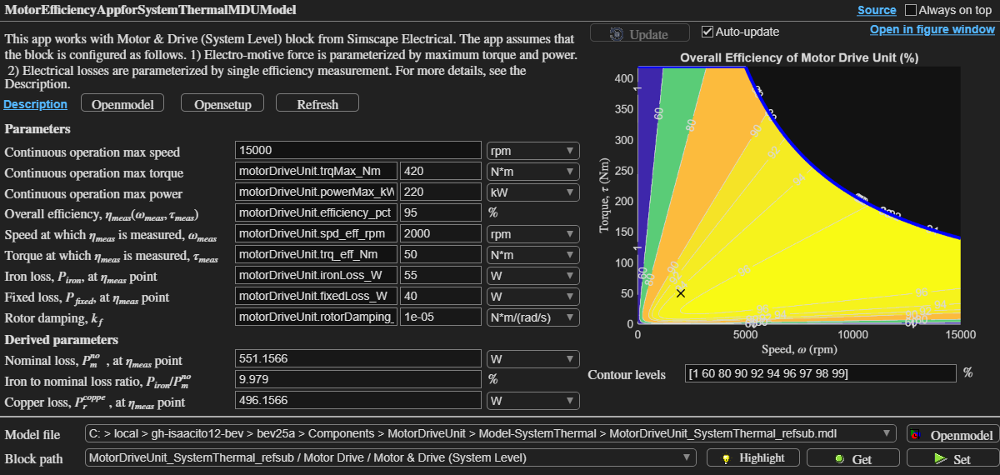

# System Thermal Model of Motor Drive Unit

## Description

This folder contains a `SystemThermal` version of a Motor Drive Unit (MDU)
as [a referenced subsystem][doc-refsub] component.
To run simulation, use a test model provided with this component.

- Referenced subsystem file: `MotorDriveUnit_SystemThermal_refsub.mdl`
- Parameter file: `MotorDriveUnit_SystemThermal_params.m`

The primary block of this component is
[Motor & Drive (System-Level) block][doc-motor-drive] from
Simscape Electrical. The block is configured as follows.

- Electro-motive force is parameterized by maximum torque and power.
- Intermittent over-torque is not allowed.
- Electrical losses are parameterized by single efficiency measurement.
- Thermal port is enabled.

[doc-refsub]: https://www.mathworks.com/help/simulink/ug/create-and-use-referenced-subsystems-in-models-using-subsystem-reference.html
[doc-motor-drive]: https://www.mathworks.com/help/sps/ref/motordrivesystemlevel.html

## Efficiency app

Use `MotorDriveUnit_SystemThermalModelEfficiencyApp` to see
the map of electro-mechanical power conversion efficiency.

## Simulation cases

A few simulation cases are provided in the `SimulationCases` folder
to demonstrate the model behaviors.
They also serve as simple test cases including stress tests.

_Copyright 2025 The MathWorks, Inc._
