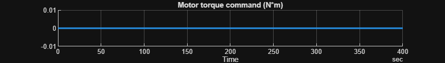
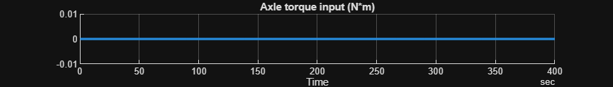
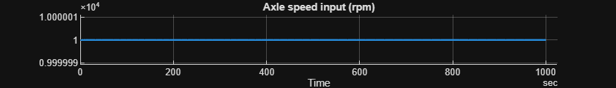
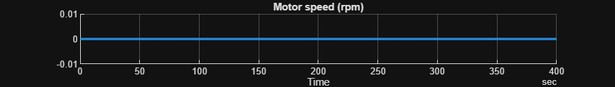
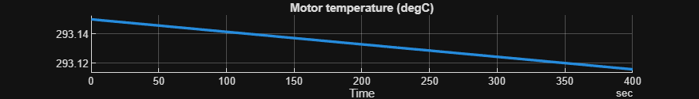
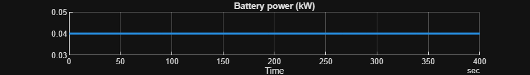
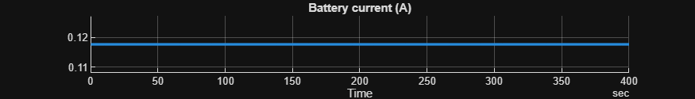
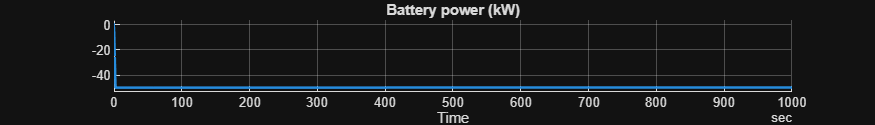

# <span style="color:rgb(213,80,0)">Motor Drive Unit \- Simulation Case</span>

# Constant input signals

Check that the model runs out of the box.

```matlab
model_name = "HarnessModel_MotorDriveUnit";
load_system(model_name)

HarnessSetup_MotorDriveUnit

set_param(model_name + "/Motor Drive Unit", ReferencedSubsystem = "MotorDriveUnit_SystemThermal_refsub")

set_param(model_name + "/Inputs", ReferencedSubsystem = "Inputs_MotorDriveUnit_Constant_refsub")

% Initial conditions
initial.LoadInertiaSpeed = simscape.Value(0, "rpm");
initial.motorDriveUnit_RotorSpd_rpm = 0;
initial.ambientTemp_K = motorDriveUnit.ambientTemp_K;

sim_in = Simulink.SimulationInput(model_name);
sim_in = setModelParameter(sim_in, StopTime = "400");
```

Run simulation.

```matlab
sim_out = sim(sim_in);
```

Visually inspect the result.

```matlab
sim_data = extractTimetable(sim_out.logsout);

% Signal logging names in the model.
signal_names = [
  "Motor torque command"
  "Axle torque input"
  "Motor power rate"
  "Motor speed"
  "Motor temperature"
  "Battery power"
  "Battery current"
  "Battery voltage"
  ];

for idx = 1 : numel(signal_names)
  fig = SignalUtil1.plotTimedData(TimedData = sim_data, SignalName = signal_names(idx));
  fig.Position(4) = 100;  % height
end
```

<center></center>


<center></center>


<center></center>


<center></center>


<center></center>


<center></center>


<center></center>


<center></center>


*Copyright 2021\-2025 The Mathworks, Inc.*

