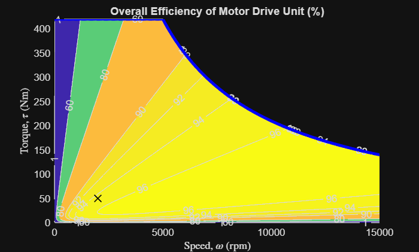

# <span style="color:rgb(213,80,0)">Efficiency Map of Motor Drive Unit</span>

This script collects block parameters from the System Thermal model of Motor Drive Unit component and makes a plot of motor efficiency contour map.

# System model
```matlab
model_name = "MotorDriveUnit_SystemThermal_refsub";
MotorDriveUnit_SystemThermal_params
load_system(model_name)
block_path = model_name + "/Motor Drive/Motor & Drive (System Level)";
block_info = MotorDriveUnit_getSystemThermalModelBlockInfo(block_path);
disp(block_info)
```

```matlabTextOutput
                        MaxTorque: 420 (N*m)
                         MaxPower: 220 (kW)
                     ResponseTime: 0.0200 (s)
                EfficiencyPercent: 95 (1)
                    MeasuredSpeed: 2000 (rpm)
                   MeasuredTorque: 50 (N*m)
                         IronLoss: 55 (W)
                        FixedLoss: 40 (W)
                     RotorInertia: 5.0000e-04 (kg*m^2)
                     RotorDamping: 1.0000e-05 (N*m*s/rad)
                InitialRotorSpeed: 0 (rpm)
                      ThermalMass: 90000 (J/K)
               InitialTemperature: 293.1500 (degC)
          MeasuredMechanicalPower: 10.4720 (kW)
              MeasuredNominalLoss: 551.1566 (W)
    IronToNominalLossRatioPercent: 9.9790 (1)
               MeasuredCopperLoss: 496.1566 (W)
```

```matlab
fig = MotorDriveUnit_EfficiencyPlot( ...
  ... In road vehicle applications,
  ... maximum motor speed is determined by vehicle top speed,
  ... tire rolling radius, and reduction gear ratio. 
  MaxSpeed = simscape.Value(15000, "rpm"), ...
  ...
  MaxTorque = block_info.MaxTorque, ...
  MaxPower = block_info.MaxPower, ...
  EfficiencyPercent = block_info.EfficiencyPercent, ...
  MeasuredSpeed = block_info.MeasuredSpeed, ...
  MeasuredTorque = block_info.MeasuredTorque, ...
  ...
  IronToNominalLossRatioPercent = block_info.IronToNominalLossRatioPercent, ...
  FixedLoss = block_info.FixedLoss, ...
  ...
  RotorDamping = block_info.RotorDamping, ...
  ...
  ContourLevelsPercent = simscape.Value([1 60 80 90 92 94 96 97 98 99], "1"), ...
  PlotResolution = 500 );
```

<center></center>


Save the plot to a PNG file. 

```matlab
% exportgraphics(fig, "tmp-plot.png")
```

*Copyright 2021\-2025 The MathWorks, Inc.*

