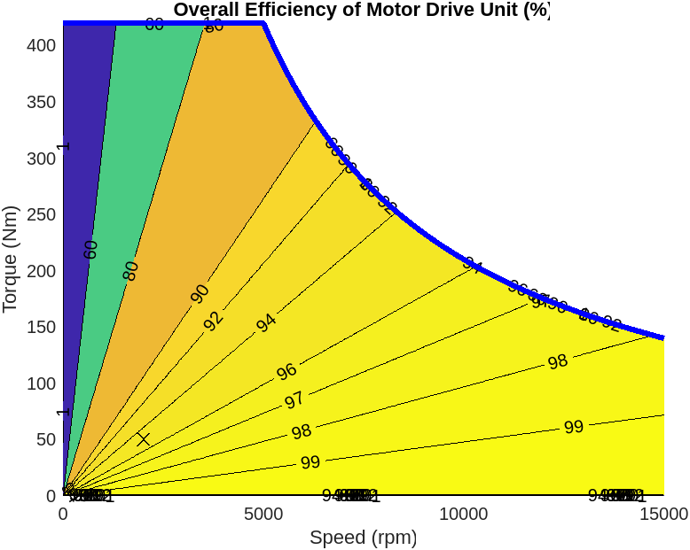
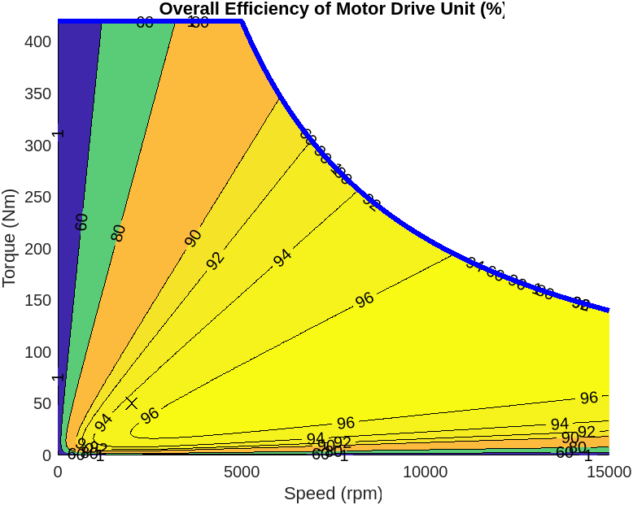

# Motor Drive Unit Component

This is a model of motor drive unit (MDU),
which is a system consisting of an electric motor and a controller.
This MDU model is abstract
and simulates the high-level behavior of power conversion
between electric and mechanical powers
by considering power conversion efficiency or losses.

## Models

The core system equations of the MDU model are
generally as follows.

```text
J * dw/dt = trq_rot + trq_cmd - k_f * w
Power_mech = trq_cmd * w
Power_elec = i * V
Power_elec = Power_mech + P_elecloss
Power_elecloss = Power_copper + Power_iron + Power_fixed
Power_copper = k_c * (trq_rot)^2
Power_iron = k_i * w^2
Mass_therm * d(T_mdu)/dt = Power_elecloss + Q_input
```

where

- `J` ... motor inertia (parameter)
- `t` ... time (independent variable)
- `w` ... rotor angular speed (state)
- `trq_rot` ... torque at motor rotor
- `trq_cmd` ... torque command input to MDU
- `k_f` ... rotor frictional damping coefficient (parameter)
- `Power_mech` ... mechanical power (intermediate variable)
- `Power_elec` ... electrical power (intermediate variable).
  The sign indicates if the system is
  generating or consuming electric power.
- `Power_elecloss` ... electrical losses (parameter).
  This  can be modelled as a scalar constant,
  a formula as a function of motor speed etc.,
  or a tabulated map.
- `i` ... electric current (connected to DC power supply)
- `V` ... voltage drop (connected to DC power supply)
- `Power_copper` ... copper loss
- `Power_iron` ... iron loss
- `Power_fixed` ... fixed loss which is constant
  across the whole operating region (parameter)
- `k_c` ... copper loss coefficient (parameter)
- `k_i` ... iron loss coefficient (parameter)
- `Mass_therm` ... thermal mass of MDU (parameter)
- `T_mdu` ... temperature of MDU (state)
- `Q_input` ... heat flow rate input to MDU

In the models below (except for System-level model with
tabulated losses),
copper loss coefficient `k_c` is deteremined using
the **single efficiency measurement model**

```text
k_c = w_meas * (1 - eff_meas) / (trq_meas * eff_meas)
```

where

- `eff_meas` ... measured efficiency (normalized between 0 and 1)
- `w_meas` ... motor speed at which efficiency is measured
- `trq_meas` ... torque at which efficiecy is measured

Iron loss coefficient `k_i` depends on
the characteristics of motor drive unit,
but it could be typically about 10% of `k_c`.

This component provides the following four models
based on the above formulation.
These models are highly abstract and run fast.

**Basic model** (`MotorDriveUnit_refsub_Basic`)
is the simplest model with the fewest parameters
among the four models.
It uses [Motor & Drive block][url-motordrive-driveline]
from Simscape Driveline.
This model takes torque command and computes
power conversion between electrical and mechanical powers
using the **single efficiency measurement model**
to compute copper loss coefficient `k_c`.
Irons loss `Power_iron` and fixed loss `Power_fixed` are not modeled.
This model does not simulate temperature dynamics.
Below is an example plot of efficiency contour of the Basic model.



[url-motordrive-driveline]: https://www.mathworks.com/help/sdl/ref/motordrive.html

**Basic thermal model** (`MotorDriveUnit_refsub_BasicThermal`)
uses [Motor & Drive block][url-motordrive-driveline],
which is the same block as the above Basic model uses,
but with thermal model enabled
to simulate motor temperature dynamics.

**System-level model** (`MotorDriveUnit_refsub_System`)
uses [Motor & Drive (System-Level) block][url-motordrive-elec]
from Simscape Electrical
to compute power conversion between electrical and mechanical powers.
Thermal model is enabled too.
Power conversion model is the same as the one
in Basic and Basic thermal models above, i.e.,
the **single efficiency measurement model**,
but irons loss `Power_iron` and fixed loss `Power_fixed` are
also considered in this model.
Below is an example plot of efficiency contour of the System-level model.



**System-level model with tabulated losses**
(`MotorDriveUnit_refsub_SystemTable`) uses
[Motor & Drive (System-Level) block][url-motordrive-elec]
from Simscape Electrical.
It takes torque command and computes motor speed
which is the same as the other models above,
but for power conversion efficiency or losses,
this model uses tabulated parameter data
as a function of motor speed and torque `Power(trq_rot, w)`
instead of the single efficiency measurement model.
Thermal model is disabled, but you can enable it
if you have two data sets of efficiency or losses
measured at two different temperatures.

[url-motordrive-driveline]: https://www.mathworks.com/help/sdl/ref/motordrive.html
[url-motordrive-elec]: https://www.mathworks.com/help/sps/ref/motordrivesystemlevel.html

## Harness model

To run simulation with the above models,
use a harness model in `Harness` folder.

- `MotorDriveUnit_harness_model.mdl`

You can select the model using buttons
in `Configuration` block.

## Simulation Cases

`SimulationCases` folder contains Live Scripts
that are used to visually inspect the simulation behaviors
of the models in various simulation scenarios as follows.

- Constant ...
  All inputs are constant.
  This is used to check that the harness model runs.

- Drive ...
  MDU drives axle by consuming electric power.

- Regenerative braking ...
  Axle drives motor, and MDU generates electric power.

- Random ....
  Input signals for motor torque command and axle load torque
  are randomly generated.

_Copyright 2022-2023 The MathWorks, Inc._
