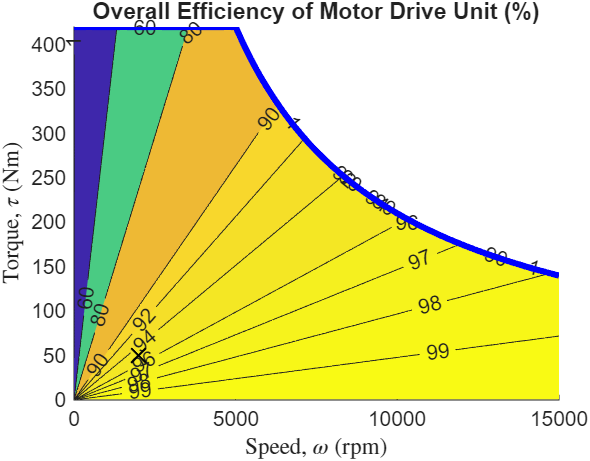
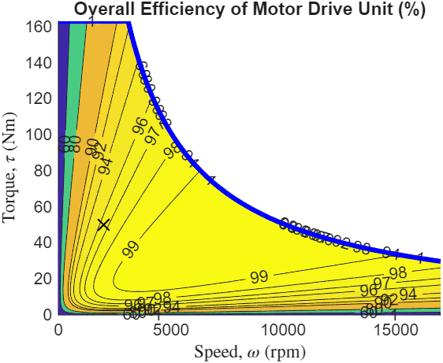

# Motor drive unit (MDU) component

This folder contains a few models of motor drive unit (MDU),
which is a system consisting of an electric motor and a controller.
The MDU models in this component are all abstract
and simulate the high-level behavior of conversion
between electric and mechanical powers
by considering power conversion efficiency or losses.

## MDU models

This component provides the following MDU models.

**Basic model** (`MotorDriveUnit_Basic_refsub`)
is the simplest model with the fewest parameters
among the provided models.
It uses [Motor & Drive block][url-motordrive-driveline]
from Simscape Driveline.
This model takes torque command and computes
electrical and mechanical power conversion
using the **single efficiency measurement model**
to compute copper loss coefficient.
Irons loss and fixed loss are not modeled.
This model does not simulate temperature dynamics.
Below is an example plot of efficiency contour of the Basic model.

[url-motordrive-driveline]: https://www.mathworks.com/help/sdl/ref/motordrive.html

**Basic thermal model** (`MotorDriveUnit_BasicThermal_refsub`)
uses [Motor & Drive block][url-motordrive-driveline],
which is the same block as the above Basic model uses,
but with thermal model enabled
to simulate motor temperature dynamics.

**System-level thermal model** (`MotorDriveUnit_System_refsub`)
uses [Motor & Drive (System-Level) block][url-motordrive-elec]
from Simscape Electrical
to compute power conversion between electrical and mechanical powers.
Thermal model is enabled too.
Power conversion model is the same as the Basic model,
which is the **single efficiency measurement model**,
but irons loss and fixed loss are also considered in this model.
Below is an example plot of efficiency contour of the System-level model.

**System-level model with tabulated losses**
(`MotorDriveUnit_SystemTable_refsub`) uses
[Motor & Drive (System-Level) block][url-motordrive-elec]
from Simscape Electrical.
It takes torque command and computes motor speed
which is the same as the other models above,
but for power conversion efficiency or losses,
this model uses tabulated parameter data
as a function of motor speed and torque.
Thermal model is disabled, but you can enable it
if you have two data sets of efficiency or losses
measured at two different temperatures.

[url-motordrive-driveline]: https://www.mathworks.com/help/sdl/ref/motordrive.html
[url-motordrive-elec]: https://www.mathworks.com/help/sps/ref/motordrivesystemlevel.html

## Test model

To run simulation with the above models, use a test model.

- `MotorDriveUnit_TestModel.mdl`

## Simulation Cases

For each model, there is `SimulationCases` folder containing
Live Scripts that are used to visually inspect the simulation behaviors
of the models in various simulation scenarios as follows.

- Constant ...
  All inputs are constant.
  This is used to check that the test model runs.

- Drive ...
  MDU drives axle by consuming electric power.

- Regenerative braking ...
  Axle drives motor, and MDU generates electric power.

- Random ....
  Input signals for motor torque command and axle load torque
  are randomly generated.

_Copyright 2022-2025 The MathWorks, Inc._
