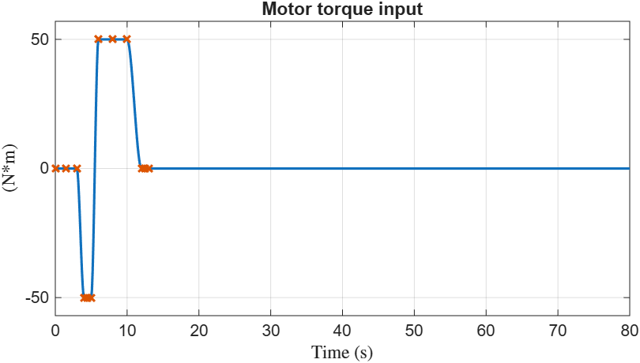
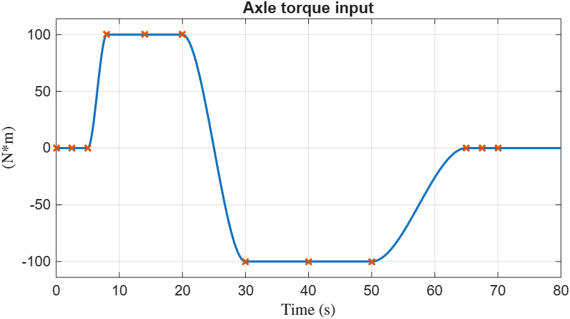

# Input signals for testing Reducer component

This folder contains the `loadLUTData_Reducer_*.m` scripts to load data
in the base worspace for use by lookup tables to test the Reducer component.

## Signals for the Flip Torque case 

_Copyright 2026 The MathWorks, Inc._
