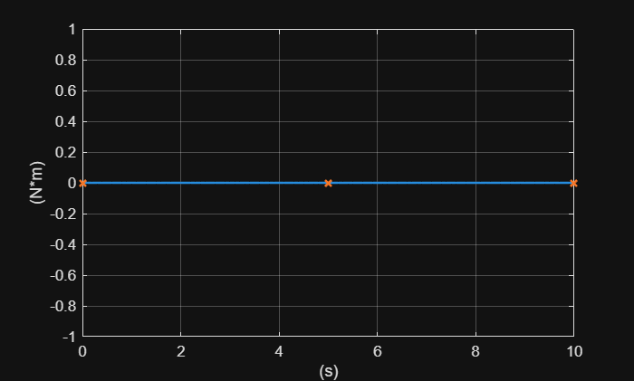
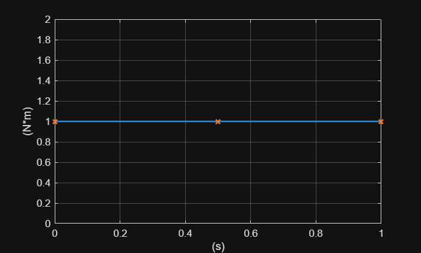
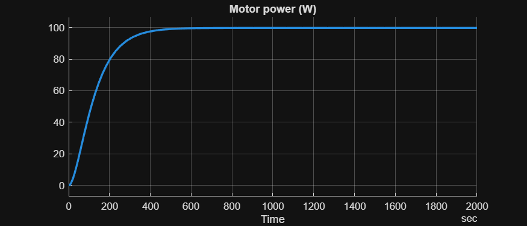
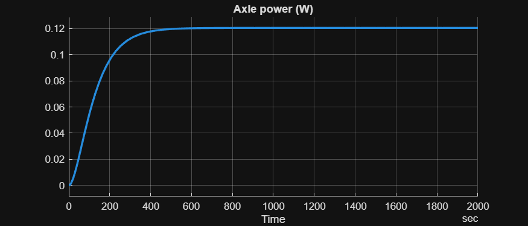
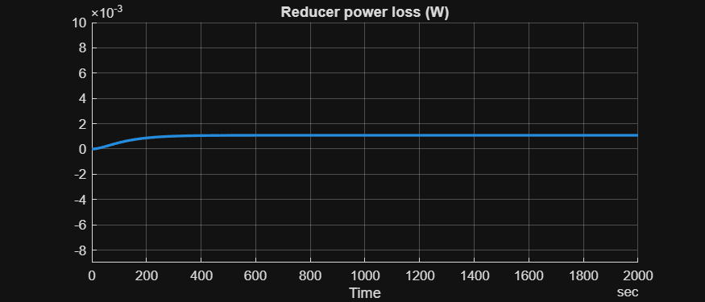

# <span style="color:rgb(213,80,0)">Reducer Basic model \- simulation case</span>

Run simulation and plot the power loss. See the `Reducer_Basic_LoggingSetup` script for how to set up Simscape selective data logging.

```matlab
model_name = "HarnessModel_Reducer";
load_system(model_name);
set_param(model_name, StopTime="2000");
evalin("base", "Reducer_Basic_params")

Reducer_setInput_AxleSide_Constant
```

<center></center>


```matlab
Reducer_setInput_MotorSide_Constant
```

<center></center>


```matlab
simOut = sim(model_name);
tt = SignalTool2.getTimetableFromLoggedSignal(simOut.logsout);
```

```matlab
varnames = string(tt.Properties.VariableNames);
for idx = 1 : numel(varnames)
  SignalTool2.plotTimedData(TimedData=tt, SignalName=varnames(idx));
end  % for
```

<center></center>


<center></center>


<center></center>


*Copyright 2025 The MathWorks, Inc.*

