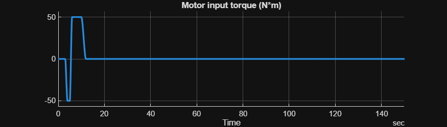
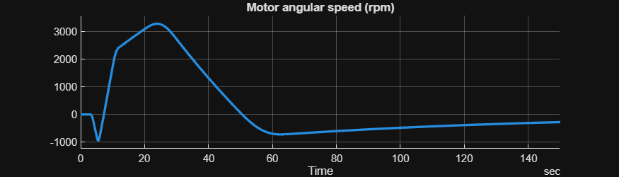
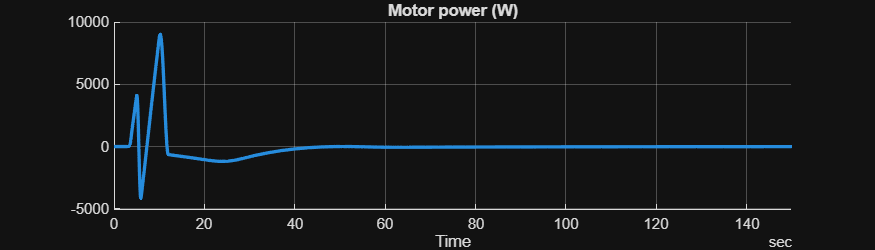
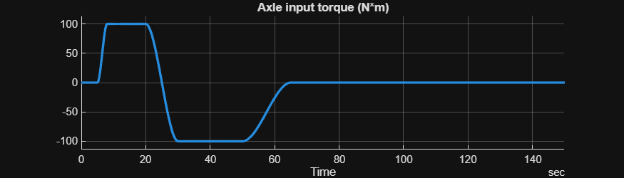
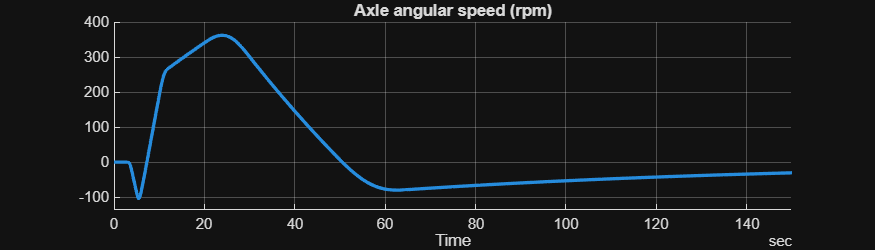
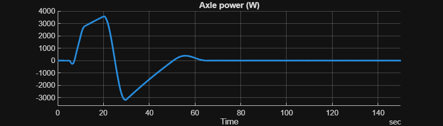
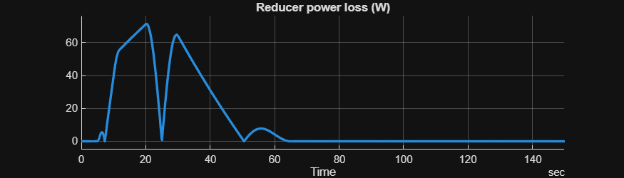

# <span style="color:rgb(213,80,0)">Reducer Basic model \- simulation case</span>
```matlab
model_name = "HarnessModel_Reducer";
load_system(model_name);

Reducer_Basic_params

sim_in = Simulink.SimulationInput(model_name);

sim_in = setBlockParameter(sim_in, model_name + "/Axle inputs", ReferencedSubsystem = "Inputs_Reducer_AxleSide_Flip_refsub");
sim_in = setBlockParameter(sim_in, model_name + "/Motor inputs", ReferencedSubsystem = "Inputs_Reducer_MotorSide_Flip_refsub");

sim_in = setModelParameter(sim_in, StopTime = "150");
```

Run simulaiton.

```matlab
sim_out = sim(sim_in);

% Signal logging for Simulink blocks is configured in the Measurement subsystem of the harness model.
% Signal logging for Simscape blocks is configured in the setupLogging_*.m files.
signals = SignalTool3.getTimetableFromLoggedSignal(sim_out.logsout);
```

Visually inspect the simulation result.

```matlab
varnames = string(signals.Properties.VariableNames);
for ii = 1 : numel(varnames)
  SignalTool3.plotTimedData(TimedData=signals, SignalName=varnames(ii), FigureHeight=200);
end  % for
```

<center></center>


<center></center>


<center></center>


<center></center>


<center></center>


<center></center>


<center></center>


*Copyright 2025 The MathWorks, Inc.*

