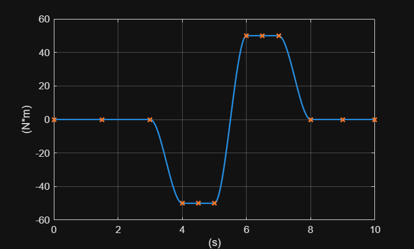
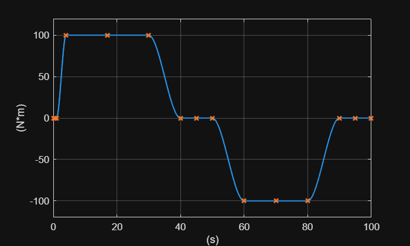
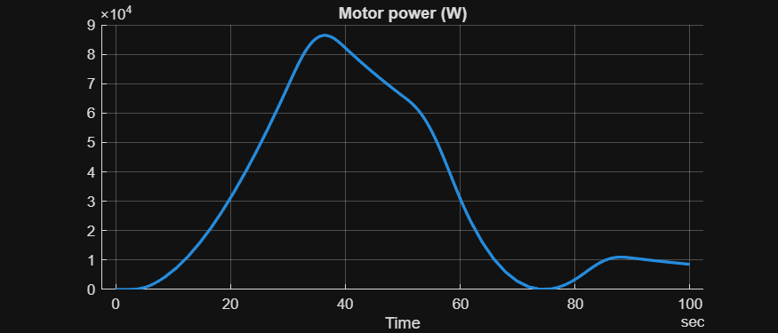
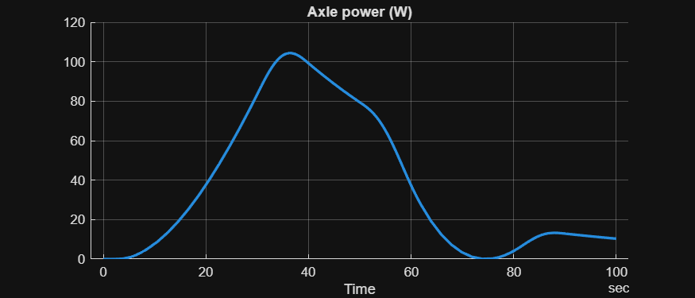
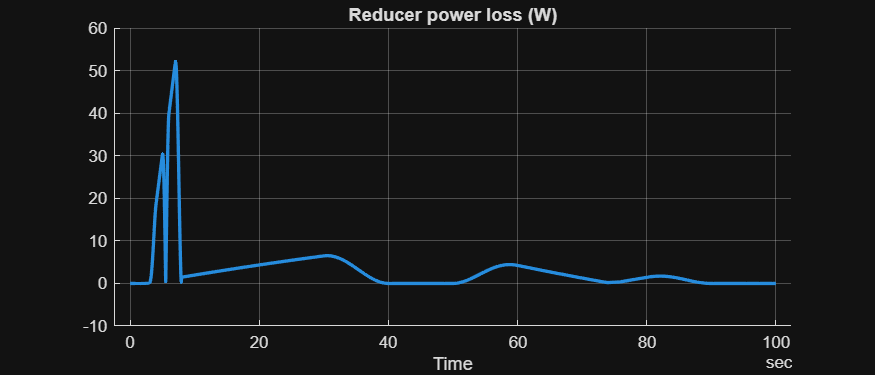
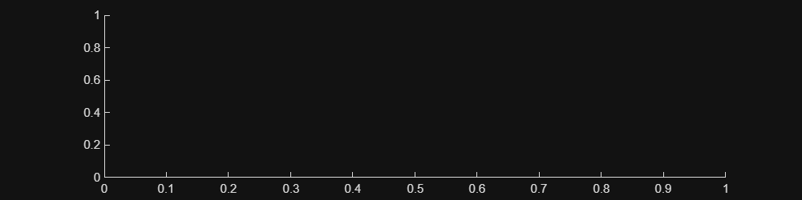

<a id="TMP_2110"></a>

# <span style="color:rgb(213,80,0)">Profiling simulation with Reducer Basic model</span>
<!-- Begin Toc -->

## Table of Contents
&emsp;[Set up](#TMP_7149)
 
&emsp;[Run simulation normally](#TMP_60a3)
 
&emsp;[Step size](#TMP_19ee)
 
&emsp;[Profiling simulation](#TMP_5c44)
 
<!-- End Toc -->

Run simulation using the Solver Profiler's `solverprofiler.profileModel` function. See the documentation about the function for details.

-  [https://www.mathworks.com/help/simulink/slref/solverprofiler.profilemodel.html](https://www.mathworks.com/help/simulink/slref/solverprofiler.profilemodel.html) 
<a id="TMP_7149"></a>

# Set up
```matlab
model_name = "Reducer_TestModel";
target_folder = fullfile(currentProject().RootFolder, "Components", "Reducer", "Model-Basic", "SimulationCases");
data_fullpath = fullfile(target_folder, "profiling_data.mat");
```
<a id="TMP_60a3"></a>

# Run simulation normally
```matlab
assert(isfolder(target_folder))
load_system(model_name);
close_system(model_name + "/Measurement/Scope")
set_param(model_name, StopTime="100");
evalin("base", "Reducer_Basic_params")
```

Input signals. These are used in PS Lookup Table (1D) blocks in the model.

```matlab
Reducer_setInput_AxleSide_1
```

<center></center>


```matlab
Reducer_setInput_MotorSide_1
```

<center></center>


Run simulation normally and plot results.

```matlab
simOut = sim(model_name);
tt = SignalTool2.getTimetableFromLoggedSignal(simOut.logsout);
varnames = string(tt.Properties.VariableNames);
for idx = 1 : numel(varnames)
  SignalTool2.TimedDataPlot(TimedData=tt, SignalName=varnames(idx));
end  % for
```

<center></center>


<center></center>


<center></center>

<a id="TMP_19ee"></a>

# Step size
```matlab
fig = figure;
fig.Position(3:4) = [800, 200];  % width, height
SignalTool2.DifferencePlot(simOut.tout, NewFigure=false, ParentAxes=axes(fig), ...
  Title="Step size", XLabel="Time", XUnitText="s", YUnitText="s")
```

<center></center>


```matlabTextOutput
Error using SignalTool2.DifferencePlot (line 14)
Invalid argument at position 1. Unable to resolve the name 'SignalTool1.mustBeStrictAscend'.
```

```matlab
step_size_data = diff(simOut.tout);
disp("Maximum step size: " + max(step_size_data))
fprintf("Minimum step size: %e", min(step_size_data))
```
<a id="TMP_5c44"></a>

# Profiling simulation

Run profiling simulation using the Solver Profiler.

```matlab
open_system(model_name)
open_system(model_name + "/Measurement/Scope")
result = solverprofiler.profileModel( ...
  model_name, ...
  DataFullFile = data_fullpath, ...
  OpenSP = "off", ... Set "on" to open the Solver Profiler after completing profiling.
  TimeOut = 10, ... in seconds. Stop the profiling simulation if the simulation does not make progress.
  StartTime = 0, ... Start time in seconds for profiling. Simulation starts from the model's StartTime which is usually 0.
  StopTime = 100, ... Stop time in seconds for simulation and profiling. The model's StopTime is not affected by this option.
  BufferSize = 50000, ... Maximum number of events to log.
  SaveStates = "on", ...
  SaveSimscapeStates = "on", ...
  SaveJacobian = "on", ...
  SaveZCSignals = "on" );
```

View the high\-level summary of profiling result. See the documentation for details.

-  `tStart` \- Start time in seconds for profiling. Can be different from simulation start time. 
-  `tStop` \- Stop time in seconds for profiling. Can be different from simulation stop time. 
-  `absTol` \- Absolute tolerance for the solver. 
-  `relTol` \- Relative tolerance for the solver. 
-  `hMax` \- Maximum step size. 
-  `hAverage` \- Average size of steps taken by the solver. 
-  `steps` \- Total number of time steps. 
-  `profileTime` \- Elapsed time in seconds. 
-  `zcNumber` \- Number of zero crossings detected. 
-  `resetNumber` \- Number of solver resets that occurred. 
-  `jacobianNumber` \- Number of times the solver updated the Jacobian matrix. 
-  `exceptionNumber` \- Total number of solver exceptions that occurred. 
```matlab
disp(result.summary)
```

Open the Solver Profiler with the saved session data.

```matlab
%solverprofiler.exploreResult(char(data_fullpath))
```

*Copyright 2025 The MathWorks, Inc.*

