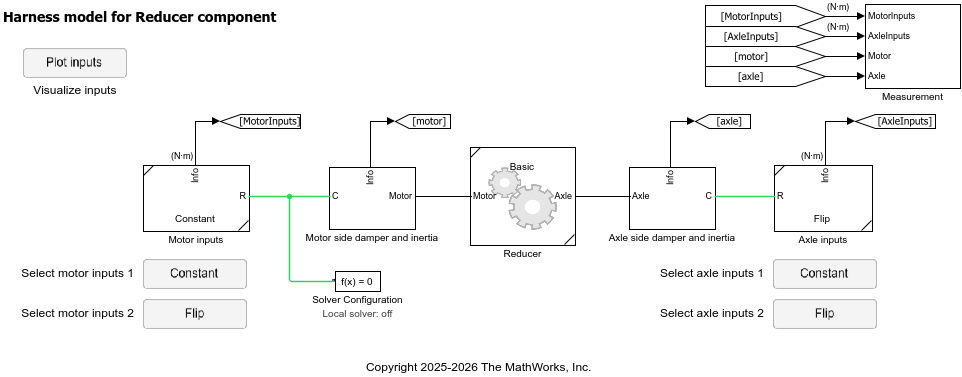

# Reducer Component

This is a road vehicle component representing
a reduction gear system sitting between motor and wheel axle.

Use the harness model for performing component-level tests.

- `HarnessModel_Reducer.mdl`

_Copyright 2023-2025 The MathWorks, Inc._
