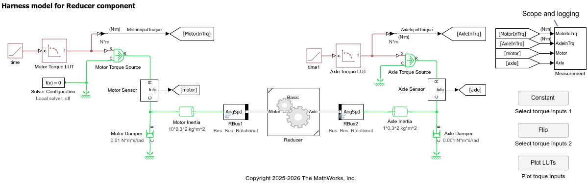

# Reducer component

This is a Reducer component representing
a reduction gear system between a motor drive unit and a wheel axle.

Use the `HarnessModel_Reducer.mdl` harness model for component-level tests.

_Copyright 2023-2026 The MathWorks, Inc._
