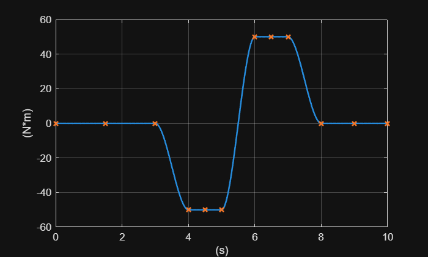

# <span style="color:rgb(213,80,0)">Input signal design</span>

This is a programmatic way of buidling a smooth signal trace for the PS Lookup Table (1D) block. For a graphical interface, use the Signal Design App which you can find in Project root > Utility > SignalTool.

```matlab
model_name = "Reducer_TestModel";

% Block path for a PS Lookup Table (1D) block.
block_path = model_name + "/Input/Axle side input torque";
```

Define a signal design matrix. For details about the signal design matrix, see the description in Project root > Utility > SignalTool.

```matlab
design_matrix = [
  0 3 0 ;
  4 5 -50 ;
  6 7 50 ;
  8 10 0 ];
dx = 0.01;
x_unit = "s";
f_unit = "N*m";
interp_method = "Smooth";
extrap_method = "Nearest";

result = SignalTool1.getXYVectorsFromSignalDesignMatrix(design_matrix);
x = result.X';
f = result.Y';

SignalTool1.LookupTable1DPlot( ...
  x, f, ...
  XUnitText = x_unit, ...
  YUnitText = f_unit, ...
  Interpolation = interp_method, ...
  Extrapolation = extrap_method, ...
  InterpolationInterval = dx, ...
  PlotXLowerBound = x(1), ...
  PlotXUpperBound = x(end) );
```

<center></center>


```matlab
x_text = LiteApp6.Utility.stringify(x);
f_text = LiteApp6.Utility.stringify(f);
design_matrix_text = LiteApp6.Utility.stringify(design_matrix);
```

Set up the target PS Lookup Table (1D) block.

```matlab
load_system(model_name)

set_param(block_path, "x", x_text)
set_param(block_path, "x_unit", x_unit);

set_param(block_path, "f", f_text)
set_param(block_path, "f_unit", f_unit);

interp_method = "simscape.enum.interpolation." + lower(interp_method);
set_param(block_path, "interp_method", interp_method)

extrap_method = "simscape.enum.extrapolation." + lower(extrap_method);
set_param(block_path, "extrap_method", extrap_method)

% Add this text to the Description property of the target block.
% Signal Design App extracts text lines between SignalDesignMatrixStart and
% SignalDesignMatrixEnd in a PS Lookup Table (1D) block to get
% the signal design matrix from the block.
description_text = join([
  "% This text was automatically inserted by Signal Tool."
  "% SignalDesignMatrixStart"
  design_matrix_text
  "% SignalDesignMatrixEnd"
  ], newline);
set_param(block_path, "Description", description_text)
```

*Copyright 2025 The MathWorks, Inc.*

