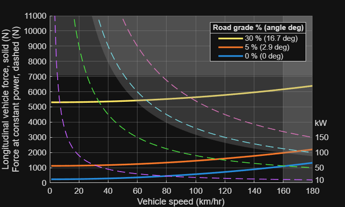

# <span style="color:rgb(213,80,0)">Vehicle1DPerformanceParameters sample script</span>
```matlab
data = Vehicle1DPerformanceParameters;
```

Set the car specs.

```matlab
% Medium car spec
data.TireRollingCoefficient = simscape.Value(0.0136, "1");
data.VehicleMass = simscape.Value(1800, "kg");
data.AirDragCoefficient = simscape.Value(0.31, "1");
data.FrontalArea = simscape.Value(2.36, "m^2");
data.TopSpeed = simscape.Value(160, "km/hr");
data.MaximumAcceleration = simscape.Value(0.4, "1");
data.MaximumClimbGrade = simscape.Value(5, "1");
```

Make sure to update the derived parameters.

```matlab
data = update_states(data);
disp(data)
```

```matlabTextOutput
  Vehicle1DPerformanceParameters with properties:

    VehicleParameterizationType: Regular
                    VehicleMass: 1800 (kg)
              TireRollingRadius: 0.3000 (m)
         TireRollingCoefficient: 0.0136 (1)
             AirDragCoefficient: 0.3100 (1)
                    FrontalArea: 2.3600 (m^2)
      GravitationalAcceleration: 9.8100 (m/s^2)
                     AirDensity: 1.1840 (kg/m^3)
                      RoadLoadA: 240.1488 (N)
                      RoadLoadB: 0 (N*s/m)
                      RoadLoadC: 0.4331 (N*s^2/m^2)
                       TopSpeed: 160 (km/hr)
            MaximumAcceleration: 0.4000 (1)
                   MaximumForce: 7064 (N)
              MaximumClimbGrade: 5 (1)
              MaximumClimbPower: 88 (kW)
                         Preset: ""
                     PlotGrades: [0 5 30] (1)
                     PlotAngles: [0 2.8624 16.6992] (deg)
                     PlotPowers: [10 50 100 150] (kW)
            PlotForceUpperBound: 11000 (N)
            PlotSpeedUpperBound: 180 (km/hr)
                  PlotForceUnit: N
                  PlotSpeedUnit: km/hr
                 NumSpeedPoints: 100
                          x_max: 180
                      vel_climb: [2x1 simscape.Value] (km/hr)
                        F_climb: [2x1 simscape.Value] (N)
```


Use the data, for example, to create the longitudinal performance plot.

```matlab
Vehicle1DPerformancePlot( ...
  VehicleMass = data.VehicleMass, ...
  GravitationalAcceleration = data.GravitationalAcceleration, ...
  RoadLoadA = data.RoadLoadA, ...
  RoadLoadB = data.RoadLoadB, ...
  RoadLoadC = data.RoadLoadC, ...
  TopSpeed = data.TopSpeed, ...
  MaximumAcceleration = data.MaximumAcceleration, ...
  MaximumClimbPower = data.MaximumClimbPower, ...
  PlotGrades = data.PlotGrades, ...
  PlotPowers = data.PlotPowers, ...
  PlotForceUpperBound = data.PlotForceUpperBound, ...
  PlotForceUnit = data.PlotForceUnit, ...
  PlotSpeedUpperBound = data.PlotSpeedUpperBound, ...
  PlotSpeedUnit = data.PlotSpeedUnit );
```

<center></center>


*Copyright 2025 The MathWorks, Inc.*

