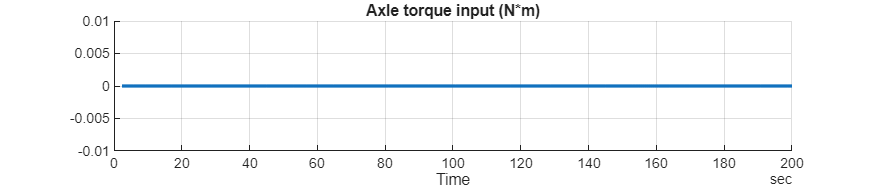
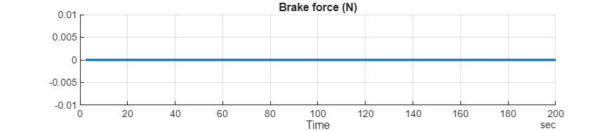
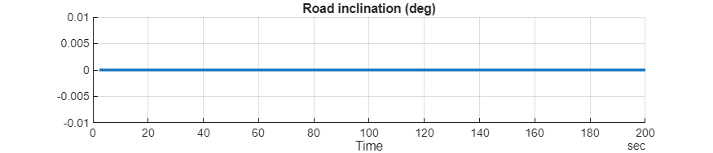
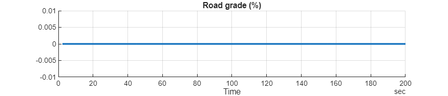
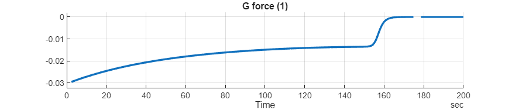
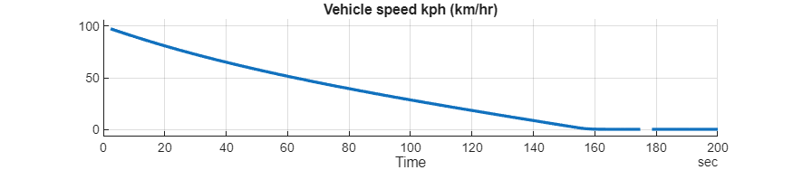
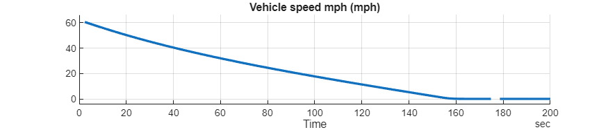
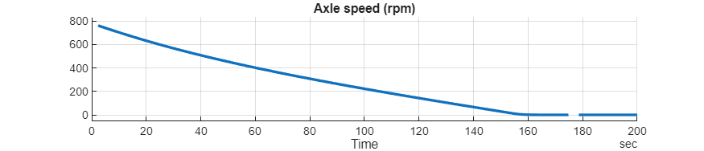

<a id="T_1FFD3858"></a>

# <span style="color:rgb(213,80,0)">Longitudinal Vehicle \- Simulation Case</span>
<a id="H_1B376934"></a>

# Coastdown
```matlab
model_name = "HarnessModel_Vehicle1D";
load_system(model_name)

Vehicle1D_Basic_params

set_param(model_name + "/Longitudinal Vehicle", ReferencedSubsystem = "Vehicle1D_Basic_refsub");

set_param(model_name + "/Inputs", ReferencedSubsystem = "Inputs_Vehicle1D_Coastdown_refsub");
```

```matlab
initial.vehicle_speed_kph = 100;

sim_in = Simulink.SimulationInput(model_name);
sim_in = setModelParameter(sim_in, StopTime = "200");

sim_out = sim(sim_in);

sim_data = extractTimetable(sim_out.logsout);

signal_names = [
  "Axle torque input"
  "Brake force"
  "Road inclination"
  "Road grade"
  "G force"
  "Vehicle speed kph"
  "Vehicle speed mph"
  "Axle speed"
  ];

for idx = 1 : numel(signal_names)
  fig = SignalTool3.plotTimedData(TimedData = sim_data, SignalName = signal_names(idx));
  fig.Position(4) = 150;  % height
end  % for
```

<center></center>


<center></center>


<center></center>


<center></center>


<center></center>


<center></center>


<center></center>


<center></center>


 *Copyright 2020\-2025 The Mathworks, Inc.*

