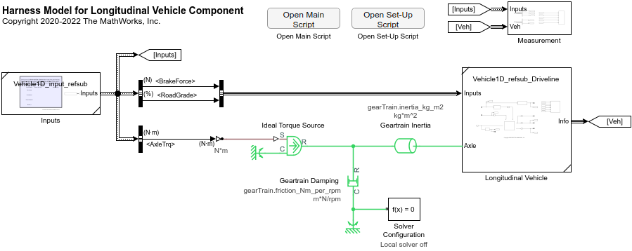
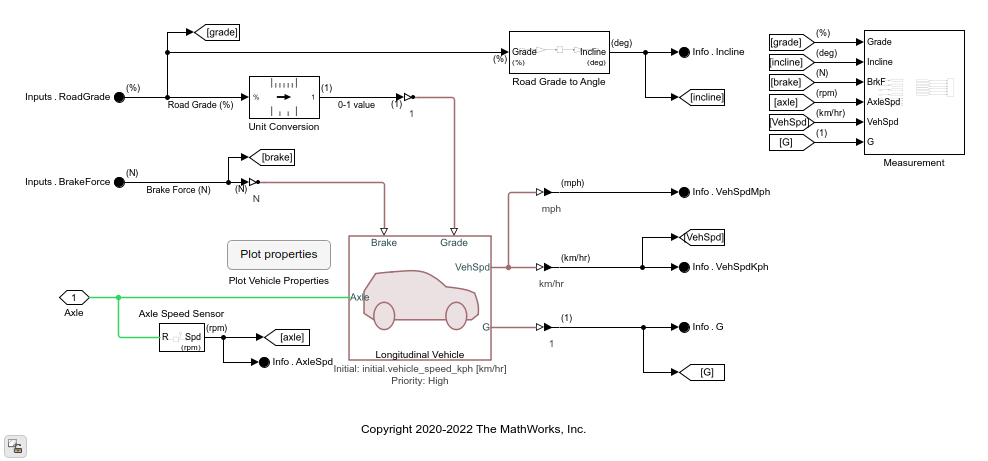
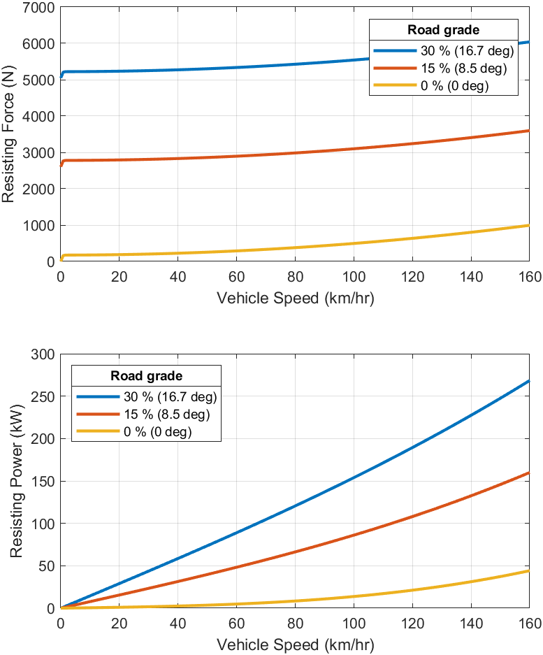

# Component / Vehicle 1D

Component to compute the longitudinal speed of a road vehicle.

The default main component subsystem uses
[Longitudinal Vehicle block][url-1] from Simscape Driveline.

[url-1]:https://www.mathworks.com/help/physmod/sdl/ref/longitudinalvehicle.html

## Harness Model

## Main Component Subsystem

## Vehicle Property

*Copyright 2022 The MathWorks, Inc.*
