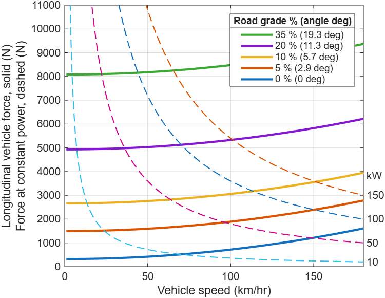
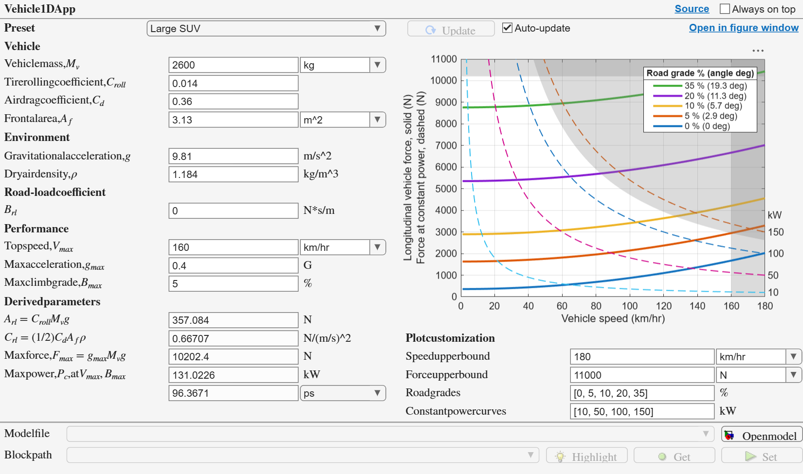
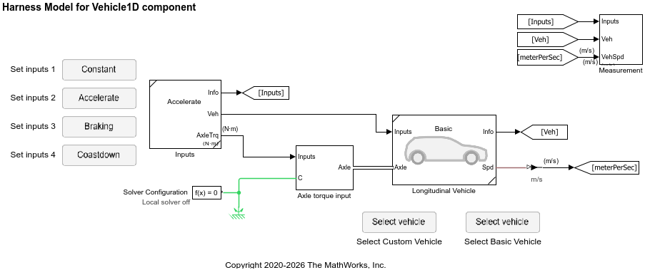

# Vehicle1D component

This is a component to compute the longitudinal speed of a road vehicle.
The main block of this component is
[Longitudinal Vehicle block][url-veh] from Simscape Driveline
which is an abstract model parameterized with commonly available
vehicle specifications such as vehicle weight, tire rolling radius, etc.

[url-veh]:https://www.mathworks.com/help/physmod/sdl/ref/longitudinalvehicle.html

A vehicle is characterized by longitudinal force and power as shown below.
These properties are the key information to design
overall vehicle performance.

## Vehicle1D App

Use the Vehicle1D App to compute
the vehicle's longitudinal force and power curves.

## Harness model

Use the harness model for performing component-level tests.

- `HarnessModel_Reducer.mdl`

*Copyright 2022-2026 The MathWorks, Inc.*
