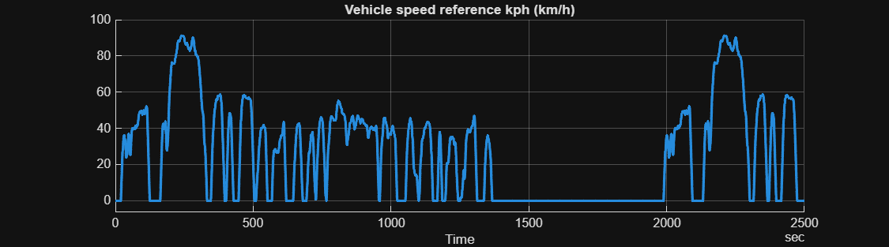

# <span style="color:rgb(213,80,0)">Vehicle Speed Reference \- Simulation Case</span>
```matlab
model_name = "HarnessModel_VehSpdRef";
load_system(model_name)

sim_in = Simulink.SimulationInput(model_name);
sim_in = setBlockParameter(sim_in, gcs + "/Vehicle speed reference", ReferencedSubsystem = "VehSpdRef_FTP75_refsub");
sim_in = setModelParameter(sim_in, StopTime = "2500");
applyToModel(sim_in)

sim_out = sim(sim_in);

sim_data = extractTimetable(sim_out.logsout);

SignalUtil1.plotTimedData( ...
  TimedData = sim_data, ...
  SignalName = "Vehicle speed reference kph", ...
  FigureHeight = 250, ...
  FigureWidth = 900 )
```

<center></center>


*Copyright 2025 The MathWorks, Inc.*

