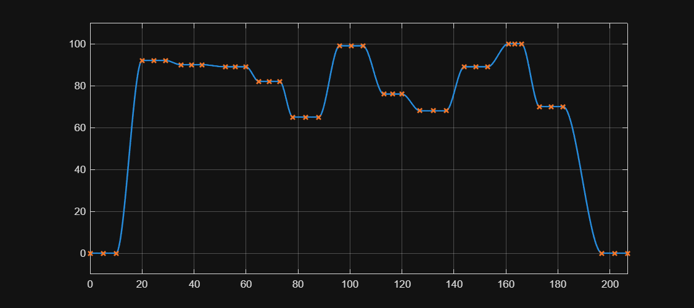

# <span style="color:rgb(213,80,0)">Vehicle Speed Reference / HighSpeed sample script</span>

This script defines the High Speed drive pattern and sets it to Simullink 1D Lookup Table block.

```matlab
% The block is 1D Lookup Table block, which is a Simulink block.
block_path = "VehSpdRef_HighSpeed_refsub/Vehicle speed reference";

signal_design_matrix = SignalTool2.generateSignalDesignMatrixFromTraceProperties(...
  RandomSeed = 6, ... Random seed
  ...
  FInitialValue = 0, ... Initial data value
  XInitialFlatLength = 10, ... Initial constant duration
  XInitialTransitionLength = 10, ... Initial transition duration
  ...
  NumTransitions = 10, ... Number of transitions
  TransitionXRange = [5 10], ... Range of transition duration
  FlatXRange = [5 10], ... Range of constant duration
  FRange = [60 100], ... Range of data value
  ...
  XFinalTransitionLength = 15, ... Final transition duration
  FFinalValue = 0, ... Final data value
  XFinalFlatLength = 10 );  % Final constant duration

data_table = SignalTool2.getVectorsFromSignalDesignMatrix(signal_design_matrix);

fig = figure;
fig.Position(3:4) = [900 400];  % width height
SignalTool2.plotLookupTable1D(data_table.X, data_table.F, ...
  Interpolation="Smooth", InterpolationInterval=0.1, ...
  ParentAxes=axes(fig))
```

<center></center>


```matlab
model_name = extractBefore(block_path, "/");
load_system(model_name)

% Time in seconds
t_data = data_table.X;
set_param(block_path, "BreakpointsForDimension1", CodeTool1.stringify(t_data'))

% Physical unit is defined as Simulink property in the refsub.
f_data = data_table.F;
set_param(block_path, "Table", CodeTool1.stringify(f_data'))
```

*Copyright 2025 The MathWorks, Inc.*

