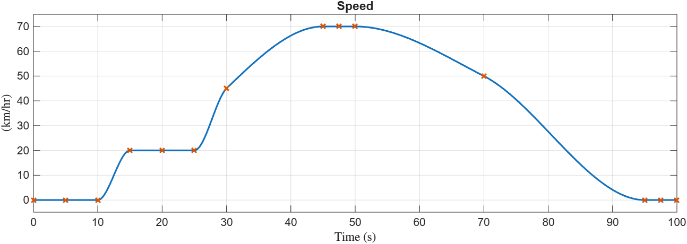
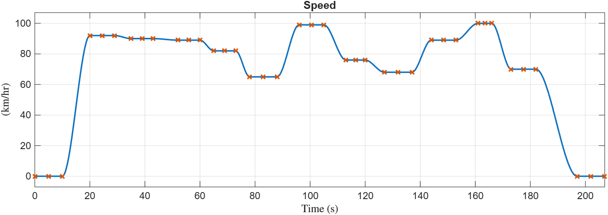
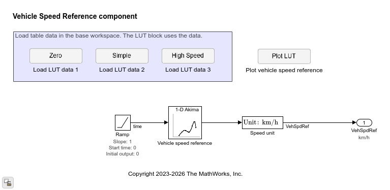
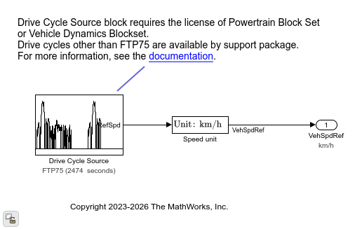
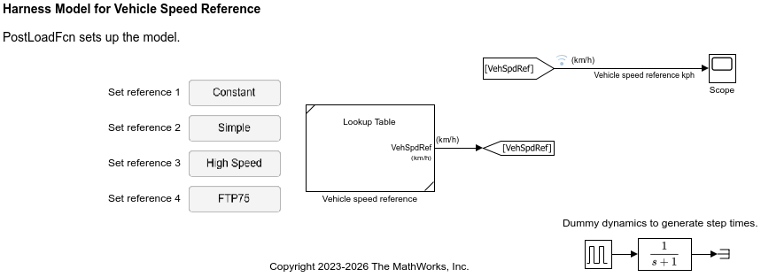

# Vehicle speed reference

This folder contains a vehicle speed reference component.
The component acts as an external speed input representing a drive cycle.
A vehicle speed controller can use it as a speed reference together with
an actual vehicle speed to determine the command to control the longitudinal vehicle speed.

The component provides the following cases:
**Constant**, **Simple**, **High speed**, and **FTP-75**.

The Constant case outputs 0.

The Simple case provides a simple speed profile.

The High speed case provides a speed profile at high-speed region.

The Constant, Simple, and High speed cases are available
as `VehSpdRef_LookupTable_refsub`.

The FTP-75 case requires the license of the Powertrain Blockset or the Vehicle Dynamics Blockset.

To use additional drive cycles such as WLTP as a speed reference,
install the [Add-On][url-pkg] for the Drive Cycle Source block.

[url-pkg]: https://www.mathworks.com/help/autoblks/ug/install-drive-cycle-data.html

## Harness model

Use the harness model (`HarnessModel_VehSpdRef`) for testing the component.

_Copyright 2023-2026 The MathWorks, Inc._
