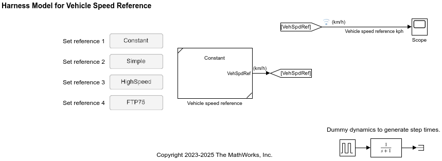

# Vehicle speed reference

This is a vehicle speed reference component for
BEV system level simulation
and provides the following speed reference patterns:

1. Simple
2. High speed
3. FTP-75
4. Constant

This component is used in the **Controller and Environment** component.

You can use other drive cycles, such as WLTP, provided by the Drive Cycle Source block
if you install the [support package][url-pkg].

[url-pkg]: https://www.mathworks.com/help/autoblks/ug/install-drive-cycle-data.html

## Harness model

Use the harness model for testing and validating the vehicle speed reference component.

- `HarnessModel_VehSpdRef.mdl`

_Copyright 2023-2025 The MathWorks, Inc._
