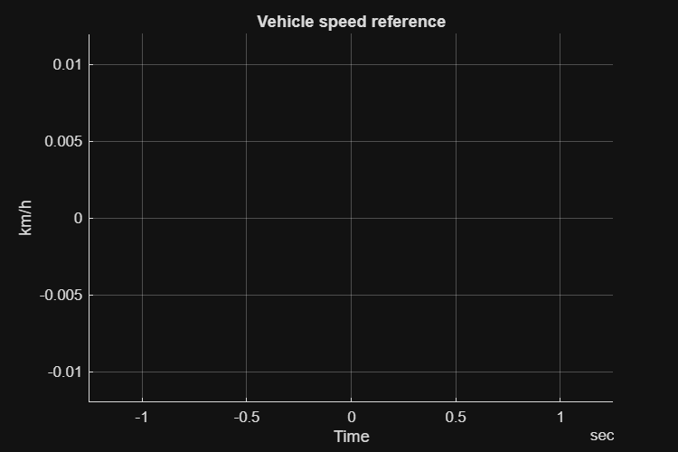

# <span style="color:rgb(213,80,0)">Vehicle Speed Reference \- Simulation Case</span>
```matlab
mdl = "VehSpdRef_TestModel";
load_system(mdl)
VehSpdRef_setRefsub_Constant
```

```matlabTextOutput
Model: VehSpdRef_TestModel
Setting up referenced subsystem: VehSpdRef_Constant_refsub
```

```matlab
simOut = sim(mdl);
simData = extractTimetable(simOut.logsout);
VehSpdRef_ResultsPlot( SimData = simData );
```

<center></center>


*Copyright 2023\-2025 The MathWorks, Inc.*

