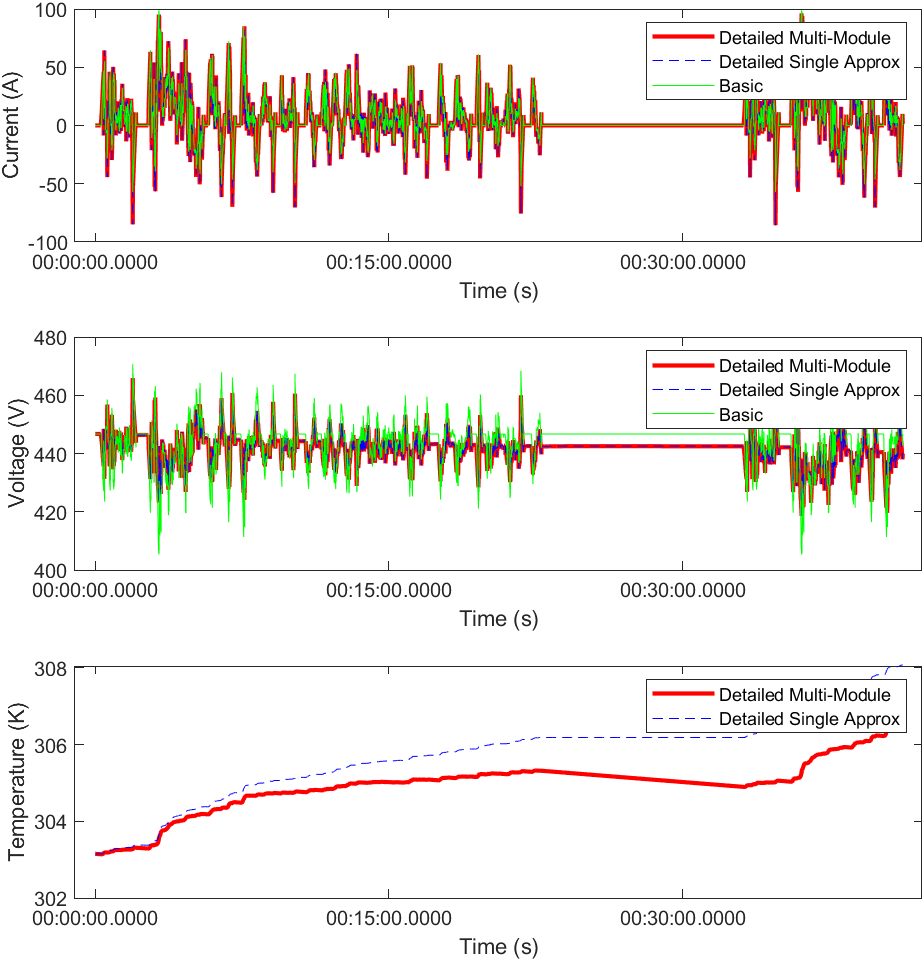

# Workflow for Battery Model Comparison in Drive Cycle Simulation

In this workflow, the BEV system model runs with
the battery models of different fidelity levels,
and the result from the higher fidelity battery model is used
to determine parameters of the lower fidelity basic battery model.

The detailed battery models are based on another project
"Battery Pack Design Solution for Battery EVs in Simscape"
available in [File Exchange][url-fx] and [github][url-gh].

[url-fx]: https://www.mathworks.com/matlabcentral/fileexchange/82330
[url-gh]: https://github.com/mathworks/Battery-Pack-Model-Simscape

_Copyright 2022 The MathWorks, Inc._
