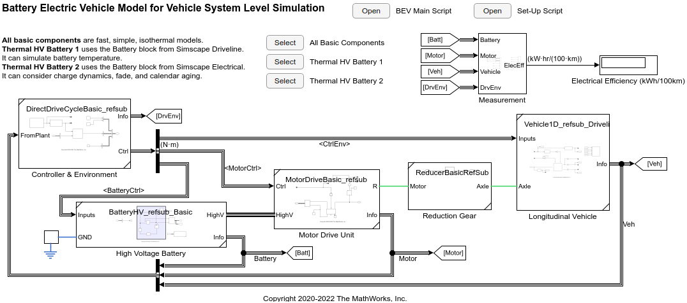
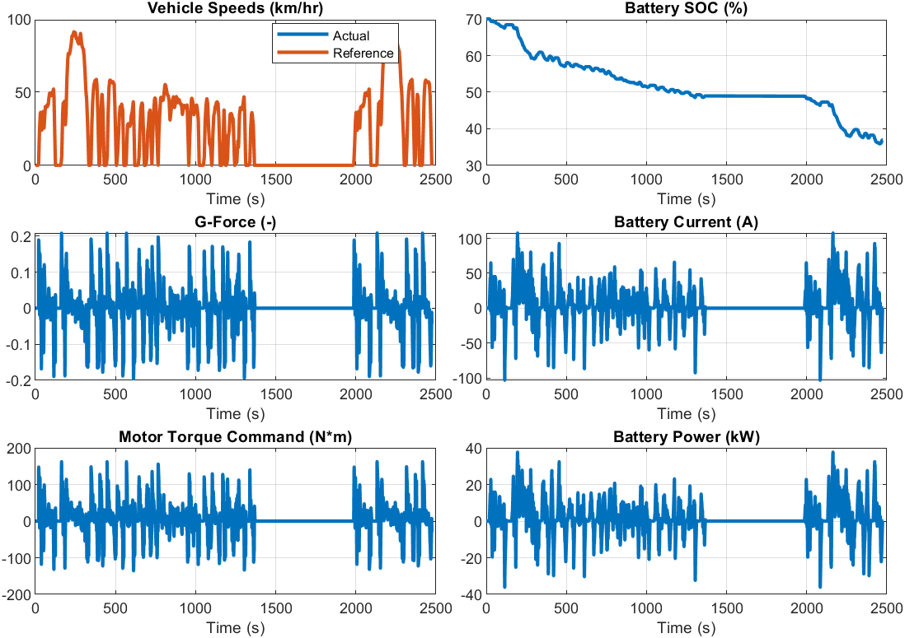

# Battery Electric Vehicle Model in Simscape&trade;

Version 1.3

## Introduction

This is a MATLAB&reg; Project containing
a Battery Electric Vehicle (BEV) model and
its components such as
motor, high voltage battery, and longitudinal vehicle.
This project demonstrates Simscape's modular and
multi-fidelity modeling technology.

The abstract BEV model is built in a simple and modular fashion,
and it can run faster than real-time.
It is suitable as a baseline model for drive cycle simulation
to estimate vehicle's electrical efficiency and
other vehicle-level information.

This project also contains the model of a detailed
permanent magnet synchronous motor (PMSM) and controller.
It captures the detailed behaviors of the AC motor drive unit
and can estimate the electrical efficiency at the unit level.

A Live Script demonstrates how to obtain the electrical efficiency
from the slow but detailed motor drive unit and use the result
as the block parameter of the simple but fast motor drive block
in the BEV model.

Watch the [YouTube video][url_yt] introducing the model.

[url_yt]:https://www.youtube.com/watch?v=i07MNXZc42c

## What's New in 1.3 (January, 2023)

- High voltage battery component has been refactored.
  It is easier to explore the battery model with the harness model.
  Table-based battery model has been added too.
- Detailed battery model built with custom Simscape library
  has been removed.
  An alternative will be provided using Simscape Battery
  in another project.
  This BEV project will focus on the vehicle system-level simulation.

## What's New in 1.2 (May, 2022)

- Unit tests were added to some models.
- GitHub Actions continuous integration is used
  to automatically run tests when the repository
  at github.com receives a push.
- This project requires MATLAB R2022a or newer.
- Abstract high-voltage battery component has
  three different fidelity levels;
  **isothermal** (same as before),
  **simple thermal** (newly added using
  System-Level Battery block from Simscape Driveline),
  and **thermal** (newly added using
  Battery block from Simscape Electrical).
  They all run fast.

See [Change Log](ChangeLog.md) for more details.

## Tool Requirements

Supported MATLAB Version:
R2020b and newer releases

Required:
[MATLAB](https://www.mathworks.com/products/matlab.html),
[Simulink&reg;](https://www.mathworks.com/products/simulink.html),
[Powertrain Blockset](https://www.mathworks.com/products/powertrain.html),
[Simscape](https://www.mathworks.com/products/simscape.html),
[Simscape Driveline&trade;](https://www.mathworks.com/products/simscape-driveline.html),
[Simscape Electrical&trade;](https://www.mathworks.com/products/simscape-electrical.html)

Optional:
[Parallel Computing Toolbox&trade;](https://www.mathworks.com/products/parallel-computing.html)

## How to Use

Open `BatteryElectricVehicle.prj` in MATLAB, and
it will automatically open the Live Script `BEV_main_script.mlx`.
The script contains the description of the model and
hyperlinks to models and scripts.

## How to Use in MATLAB Online

You can try this in [MATLAB Online][url_online].
In MATLAB Online, from the **HOME** tab in the toolstrip,
select **Add-Ons** &gt; **Get Add-Ons**
to open the Add-On Explorer.
Then search for the submission name,
navigate to the submission page,
click **Add** button, and select **Save to MATLAB Drive**.

[url_online]: https://www.mathworks.com/products/matlab-online.html

## License

See [`LICENSE.txt`](LICENSE.txt).

_Copyright 2020-2022 The MathWorks, Inc._
