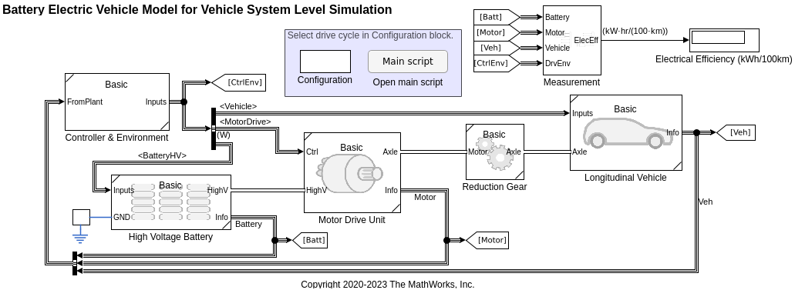
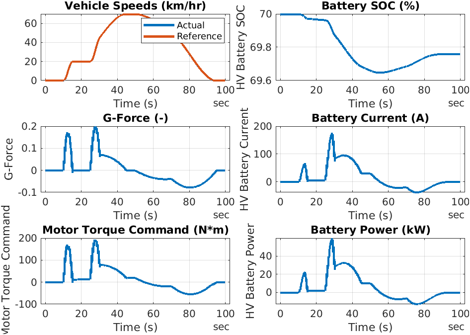

# Battery Electric Vehicle Model in Simscape&trade;

Version 2.2

## Introduction

This is a MATLAB&reg; Project containing
a [Battery Electric Vehicle (BEV) model](BEV/README.md) and
its components such as
motor, high voltage battery, and longitudinal vehicle.
This project demonstrates Simscape's modular and
multi-fidelity modeling technology.

The abstract BEV model is built in a simple and modular fashion,
and it can run faster than real-time.
It is suitable as a baseline model for drive cycle simulation
to estimate vehicle's electrical efficiency and
other vehicle-level information.

This project also contains the model of a detailed
permanent magnet synchronous motor (PMSM) and controller.
It captures the detailed behaviors of the AC motor drive unit
and can estimate the electrical efficiency at the unit level.

A Live Script demonstrates how to obtain the electrical efficiency
from the slow but detailed motor drive unit and use the result
as the block parameter of the simple but fast motor drive block
in the BEV model.

Watch the [YouTube video][url_yt] introducing the model.

[url_yt]:https://www.youtube.com/watch?v=i07MNXZc42c

## What's New in 2.2 (September, 2023)

- The project has been updated to MATLAB R2023b.
- [MATLAB Build Tool][url-buildtool] is used to automate tasks
  to generate HTML files and Jupyter notebooks from all Live Scripts
  in the project.
- GitHub Actions has been updated to generate and upload
  test report and coverage report.
- GitHub Actions also generates Jupyter notebooks from Live Scripts.
  Jupyter notebooks can be viewed in the repo in the browser.

[url-buildtool]: https://www.mathworks.com/help/matlab/matlab_prog/overview-of-matlab-build-tool.html

## What's New in 2.1 (March, 2023)

- The project has been updated to MATLAB R2023a.
- A shortcut button to open **MATLAB Test Manager**
  is added in the Project Shortcuts tab of the toolstrip.
  MATLAB Test Manager requires the **MATLAB Test** license.

See [Change Log](ChangeLog.md) for more details.

## What's New in 2.0 (February, 2023)

- BEV system model uses updated components and
  has simpler and easier configurability
  for selecting vehicle speed reference input.
- High voltage battery component provides
  four different models:
  **Basic**, **System simple**, **System**, and **System tabulated**.
  They are all system level models and abstract,
  but they prodive different fidelity levels of the model.
  See [README](./Components/BatteryHighVoltage/README.md) in
  **Components > BatteryHighVoltage** for more details.
- Motor drive unit component provides
  four different models:
  **Basic**, **Basic thermal**, **System**, and **System tabulated**.
  They are all system level models and abstract,
  but they prodive different fidelity levels of the model.
  See [README](./Components/MotorDriveUnit/README.md) in
  **Components > MotorDriveUnit** for more details.
- A detailed battery model built with a custom Simscape library
  has been removed.
  [This project][url-bev] will remain focused
  on vehicle system-level applications using abstract models
  in future updates.
  A new project [Electric Vehicle Design with Simscape][url-bev-design]
  serves as an alternative for detailed model applications.

See [Change Log](ChangeLog.md) for more details.

## Tool Requirements

Supported MATLAB Version:
R2023b or newer releases

Required:
[MATLAB](https://www.mathworks.com/products/matlab.html),
[Simulink&reg;](https://www.mathworks.com/products/simulink.html),
[Powertrain Blockset](https://www.mathworks.com/products/powertrain.html),
[Simscape](https://www.mathworks.com/products/simscape.html),
[Simscape Driveline&trade;](https://www.mathworks.com/products/simscape-driveline.html),
[Simscape Electrical&trade;](https://www.mathworks.com/products/simscape-electrical.html)

Optional:
[MATLAB Test](https://www.mathworks.com/products/matlab-test.html),
[Parallel Computing Toolbox&trade;](https://www.mathworks.com/products/parallel-computing.html)

## How to Use

Open `BatteryElectricVehicle.prj` in MATLAB, and
it will automatically open the project main page `BEV_main_script.html`.
The script contains the description of the model and
hyperlinks to models and scripts.

## How to Use in MATLAB Online

You can try this in [MATLAB Online][url_online].
In MATLAB Online, from the **HOME** tab in the toolstrip,
select **Add-Ons** &gt; **Get Add-Ons**
to open the Add-On Explorer.
Then search for the submission name,
navigate to the submission page,
click **Add** button, and select **Save to MATLAB Drive**.

[url_online]: https://www.mathworks.com/products/matlab-online.html

## Additional Notes

- [Using MATLAB Project](docs/Using-MATLAB-Project.md)

- [MATLAB Testing Framework and Beyond](docs/MATLAB-Testing-Framework.md)

## See Also

[Electric Vehicle Design with Simscape][url-bev-design]
provides BEV design workflows using detailed models
for detailed analysis.
Note that the [BEV model in Simscape][url-bev] project
(the current project you are viewing) is focused on
vehicle system-level applications using abstract models.

[Hybrid Electric Vehicle Model in Simscape][url-hev-powersplit]
provides an abstract power-split HEV model.
The level of abstraction is similar to
the [BEV model in Simscape][url-bev] project.

[url-bev]: https://www.mathworks.com/matlabcentral/fileexchange/82250
[url-bev-design]: https://www.mathworks.com/matlabcentral/fileexchange/124795
[url-hev-powersplit]: https://www.mathworks.com/matlabcentral/fileexchange/92820

## License

See [`license.txt`](license.txt).

_Copyright 2020-2023 The MathWorks, Inc._
