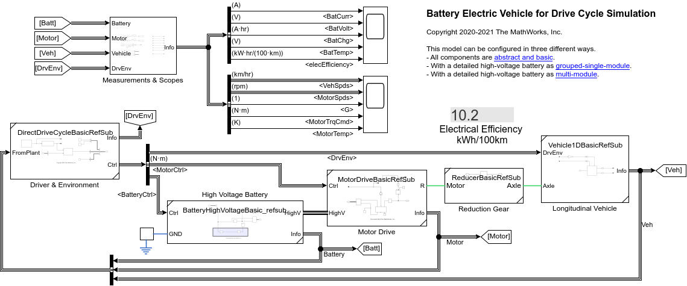
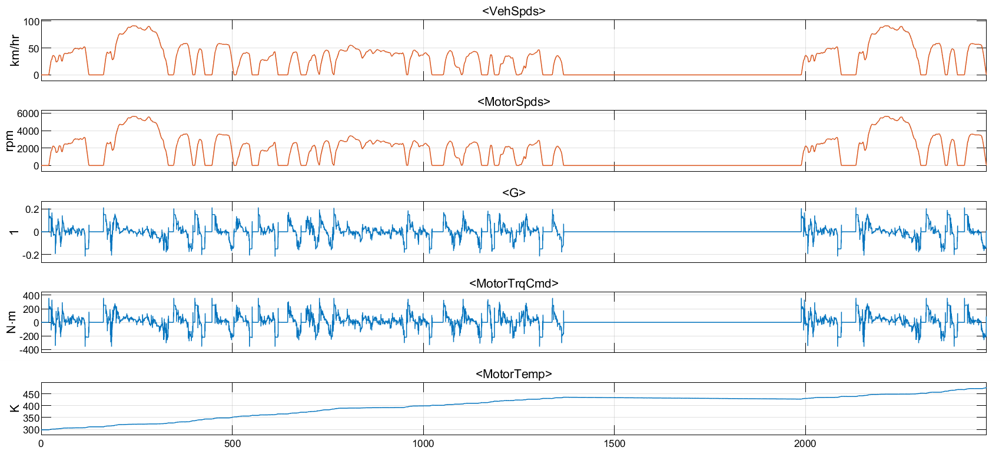

# Battery Electric Vehicle Model in Simscape&trade;

Version 1.1

Copyright 2020-2021 The MathWorks, Inc.

https://www.mathworks.com/

## Introduction

This is a MATLAB&reg; Project containing
a Battery Electric Vehicle (BEV) model and
its components such as
motor, high voltage battery, and longitudinal vehicle.
This project demonstrates Simscape's modular and
multi-fidelity modeling technology.

The abstract BEV model is built in a simple and modular fashion,
and it can run faster than real-time.
It is suitable as a baseline model for drive cycle simulation
to estimate vehicle's electrical efficiency and
other vehicle-level information.

This project also contains the model of a detailed
permanent magnet synchronous motor (PMSM) and controller.
It captures the detailed behaviors of the AC motor drive unit
and can estimate the electrical efficiency at the unit level.

A Live Script demonstrates how to obtain the electrical efficiency
from the slow but detailed motor drive unit and use the result
as the block parameter of the simple but fast motor drive block
in the BEV model.

Watch the [YouTube video][url_yt] introducing the model.

[url_yt]:https://www.youtube.com/watch?v=i07MNXZc42c

## What's New in 1.1

- A detailed high-voltage battery pack component is added.
- The BEV model supports three different component configurations
  using Subsystem Reference:
  1) All basic comopnents (same as version 1.0).
  2) [New] With a detailed high-voltage battery as grouped-single module.
  3) [New] With a detailed high-voltage battery as multi-module.
- A live script evaluating the BEV model with
  high-voltage battery component at different fidelity levels
  is added.
- This project requires MATLAB R2020b or newer.

## Tool Requirements

Supported MATLAB Version:
R2020b and newer releases

Required:
[MATLAB](https://www.mathworks.com/products/matlab.html),
[Simulink&reg;](https://www.mathworks.com/products/simulink.html),
[Powertrain Blockset](https://www.mathworks.com/products/powertrain.html),
[Simscape](https://www.mathworks.com/products/simscape.html),
[Simscape Driveline&trade;](https://www.mathworks.com/products/simscape-driveline.html),
[Simscape Electrical&trade;](https://www.mathworks.com/products/simscape-electrical.html)

Optional:
[Parallel Computing Toolbox&trade;](https://www.mathworks.com/products/parallel-computing.html)

## How to Use

Open `BatteryElectricVehicle.prj` in MATLAB, and
it will automatically open the Live Script `BEV_main_script.mlx`.
The script contains the description of the model and
hyperlinks to models and scripts.

## How to Use in MATLAB Online

You can try this in [MATLAB Online][url_online].
In MATLAB Online, from the **HOME** tab in the toolstrip,
select **Add-Ons** &gt; **Get Add-Ons**
to open the Add-On Explorer.
Then search for the submission name,
navigate to the submission page,
click **Add** button, and select **Save to MATLAB Drive**.

[url_online]:https://www.mathworks.com/products/matlab-online.html

## License

See [`LICENSE.txt`](LICENSE.txt).
