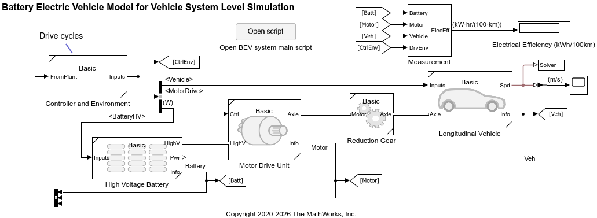
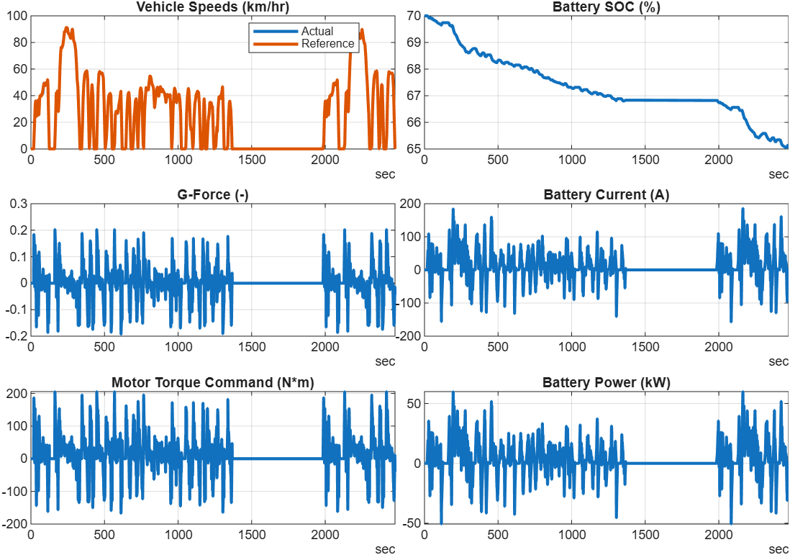
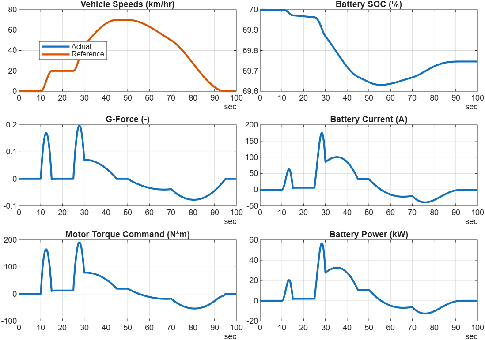
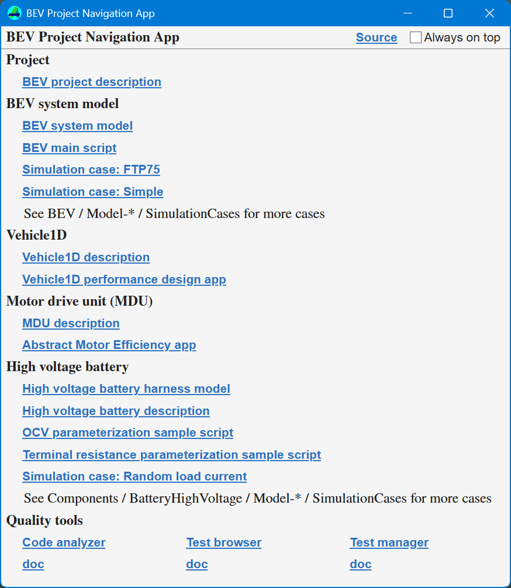
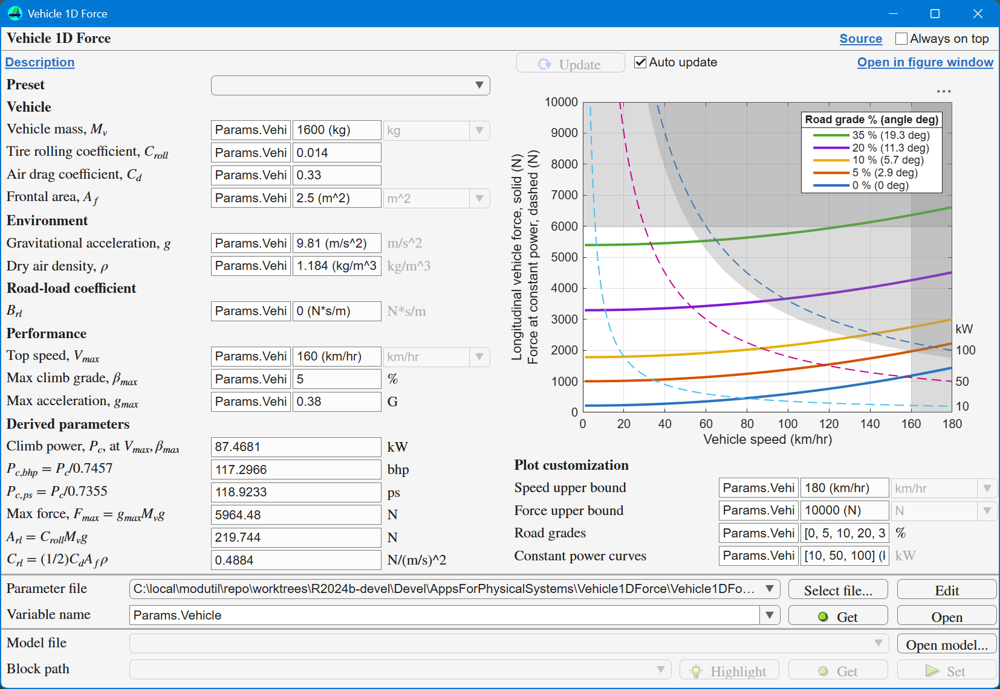
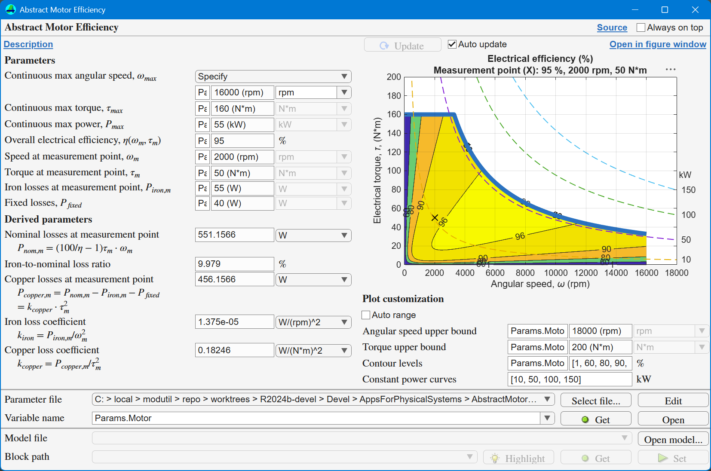

# Battery Electric Vehicle Model in Simscape&trade;

Version 5.0.0

[![View Battery Electric Vehicle Model in Simscape on File Exchange][url-fx-icon]][url-fx-bev]

[url-fx-bev]: https://www.mathworks.com/matlabcentral/fileexchange/82250
[url-fx-icon]: https://www.mathworks.com/matlabcentral/images/matlab-file-exchange.svg

Cite this project as

> MathWorks. Battery Electric Vehicle Model in Simscape
> (https://github.com/mathworks/Simscape-Battery-Electric-Vehicle-Model). GitHub, 2026.

## Introduction

This is a MATLAB&reg; project containing
a [Battery Electric Vehicle (BEV) model](BEV/README.md) and
its components such as
motor, high voltage battery, and longitudinal vehicle.
This project demonstrates Simscape's modular and
multi-fidelity modeling technology.
The abstract BEV model is built in a simple and modular fashion,
and it can run faster than real-time.
It is suitable as a baseline model for drive cycle simulation
to estimate vehicle's electrical efficiency and
other vehicle-level information.

BEV system model:

FTP75 drive cycle simulation result:

Simple drive pattern simulation result:

Use **BEV Project Navigator App** to quickly access some key files and tools.

Use **Vehicle 1D Force App** to understand and design the basic performance parameters
of a road vehicle.

Use **Abstract Motor Efficiency App** to understand and design the motor efficiency parameters.

## What's New in 5.0 (August 2026)

- The project is upgraded to R2026a.
- The utility APIs and apps are available as the Modeling Utility for Simscape (MUS).
- The updated Abstract Motor Efficiency App is available from the MUS.
- The updated Vehicle 1D Force App is available from the MUS.
- The new Elevation Profile component is available.
- The overall project size is reduced.

## What's New in 4.0 (January 2026)

- The project works in R2024b or newer.
- The version 4 is built from the version 2.

For the past What's New, see [the change log](ChangeLog.md).

## Tool Requirements

Supported MATLAB Version:
R2026a or newer releases

Required:
[MATLAB](https://www.mathworks.com/products/matlab.html),
[Simulink&reg;](https://www.mathworks.com/products/simulink.html),
[Simscape](https://www.mathworks.com/products/simscape.html),
[Simscape Driveline&trade;](https://www.mathworks.com/products/simscape-driveline.html),
[Simscape Electrical&trade;](https://www.mathworks.com/products/simscape-electrical.html),
[Powertrain Blockset](https://www.mathworks.com/products/powertrain.html)

Optional:
[MATLAB Test](https://www.mathworks.com/products/matlab-test.html)

## How to Use

Open `BatteryElectricVehicle.prj` in MATLAB, and
it will automatically open the project main page `BEV_main_script.html`.
The script contains the description of the model and
hyperlinks to models and scripts.

## How to Use in MATLAB Online

1. Upload the zip archive of
the project to [MATLAB drive][url_drive].

2. Go to the [MATLAB Online][url_online] site and launch MATLAB Online.

3. In MATLAB Online, find the zip archive, unzip it, and click the `BatteryElectricVehicle.prj` file.

[url_drive]: https://drive.mathworks.com/files/
[url_online]: https://www.mathworks.com/products/matlab-online.html

## Testing and quality assurance

BEV system model and its components are tested using [MATLAB Unit Testing framework][doc-test].

- Some tests are _passing tests_ that check if code runs or not and
  do not use the `verify*` functions.
  They simply run scripts, functions, classes,
  or models, and check that they run without errors.
  Passing tests are designed to finish quickly.

- This project uses the [buildtool][doc-buildtool] with `buildfile.m` to
  check code, run tests, measure code coverage, and generate test reports and
  code coverage reports.
  See `buildfile.m` in this project for how the buildtool is configured.
  Checking code with the buildtool is done by [Code Analyzer][doc-codeissues].

[doc-test]: https://www.mathworks.com/help/matlab/matlab_prog/class-based-unit-tests.html
[doc-buildtool]: https://www.mathworks.com/help/matlab/ref/buildtool.html
[doc-codeissues]: https://www.mathworks.com/help/matlab/ref/matlab.buildtool.tasks.codeissuestask-class.html

## Remote test automation / Continuous integration

[The git repository of this project in github.com/mathworks][url-gh-bev] is set up for
test automation using [GitHub Actions][doc-github-actions] and [MATLAB Actions][doc-mlactions].
Unit tests in this project are run automatically
when changes are pushed to the repository in github.
See the [`.github/workflows` folder](.github/workflows) for configuration files.

[doc-github-actions]: https://docs.github.com/en/actions
[doc-mlactions]: https://github.com/matlab-actions
[url-gh-bev]: https://github.com/mathworks/Simscape-Battery-Electric-Vehicle-Model

## Additional Notes

- [Using MATLAB Project](docs/Using-MATLAB-Project.md)

- [MATLAB Testing Framework](docs/MATLAB-Testing-Framework.md)

## See Also

### MATLAB Central File Exchange

Visit the File Exchange page of this project.

- https://www.mathworks.com/matlabcentral/fileexchange/82250

Hybrid Electric Vehicle Model in Simscape

- Provides an abstract power-split HEV model.
  The level of abstraction is similar to this project.
- https://www.mathworks.com/matlabcentral/fileexchange/92820

Electric Vehicle Design with Simscape

- Provides BEV design workflows using detailed models
  for detailed analysis.
- https://www.mathworks.com/matlabcentral/fileexchange/124795

## License

See [`license.txt`](license.txt).

_Copyright 2020-2026 The MathWorks, Inc._
